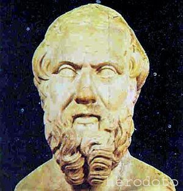

## Herodoto

Probablemente uno de los ejemplos más antiguos del uso de la criptografía sea el referido por Herodoto en *Las historias*. En este relato, Jerjes es un rey persa y Demarato un espartano expulsado de su patria que vivía en Persia.  Jerjes planeaba formar un gran ejército para invadir Grecia. Oigamos la historia en  palabras de Herodoto.

> Volveré ahora a tomar el hilo de la historia que dejé algo atrás. Los Lacedemonios fueron los primeros que tuvieron aviso de que el rey disponía una expedición contra la Grecia, lo que les movió a enviar su consulta al oráculo de Delfos, de donde les vino la respuesta poco antes mencionada. Bien creído tengo, y me parece que no sin mucha razón, no sería muy amigo ni apasionado de los Lacedemonios Demarato, hijo de Ariston, que fugitivo de los suyos se había refugiado entre los Medos,
aunque de lo que él hizo, según voy a decir, podrán todos conjeturar si obraba por el bien que les quisiese  o por el deseo que de insultarles tenía. Lo que en efecto hizo Demarato, presente en Susa, cuando resolvió Jerjes la jornada contra la Grecia,
fue procurar que llegase la cosa a noticia de los Lacedemonios; y por cuanto corría el peligro de ser interceptado el aviso, ni tenía otro medio para comunicárselo, valióse del siguiente artificio: tomó un cuadernillo de dos hojas o tablillas; rayó bien la cera que las cubría, y en la madera misma grabó con letras
la resolución del rey. Hecho esto, volvió a cubrir con cera regular las letras grabadas, para que el portador de un cuadernillo en blanco no fuera molestado de los guardas de los caminos. Llegado ya el correo a Lacedemonia, no podían dar en el misterio los mismos de la ciudad, hasta tanto que Gorgo, hija que era de Cleomenes y esposa de Leonidas, fue la que les sugirió, según oigo decir, que rayesen la cera,
habiendo ella maliciado que hallarían escrita la carta en la misma madera. Creyéronla ellos, y hallada la carta y leída, enviáronla a los demás Griegos.

Si somos aficionados a las películas de espías, esto nos suena a las artimañas que emplean los espías para transmitir la información a sus superiores.  Muchas veces lo importante no es solo transmitir la información, sino que el enemigo crea que no ha sido posible filtrar dicha información. 

Si hábil fue el proceder de Demarato, escuchemos de nuevo a Herodoto en otro pasaje de *Las historias*.

> Entonces fue cuando Aristágoras, no pudiendo cumplir la promesa hecha a Artafernes,
viéndose agobiado con el gasto de las tropas que se le pedía, temiendo además las consecuencias de aquella su desgraciada expedición, mayormente habiéndose
enemistado en ella con Megabates, sospechando, en suma, que por ella sería depuesto del
gobierno y dominio de Mileto; amedrentado, digo, con todas estas reflexiones y motivos, empezó a maquinar una sublevación para ponerse a salvo.

> Quiso a más de esto la casualidad que en aquella agitación le viniera desde Susa, de parte de Histieo,  un enviado con la cabeza toda marcada con letras, que significaban a Aristágoras que se sublevase contra el rey. Pues como Histieo hubiese querido
prevenir a su deudo que convenía rebelarse, y no hallando medio seguro para posarle el aviso por cuanto estaban los caminos tomados de parte del rey, en tal apuro había rasurado a navaja la cabeza del criado que tenía de mayor satisfacción, habíale
marcado en ella con los puntos y letras que le pareció, esperó después que le volvieran a crecer el cabello, y crecido ya, habíalo despachado a Mileto sin más recado que decirle de palabra que puesto en Mileto pidiera de su parte a Aristágoras que, cortándole
a navaja el pelo, le mirara la cabeza. Las notas grabadas en ella significaban a Aristágoras, como dije, que se levantase contra el Persa. El motivo que para tal intento tuvo Histieo, parte nacía de la pesadumbre gravísima que su arresto en Susa le ocasionaba, parte también de la esperanza con que se lisonjeaba de que en caso de tal rebelión sería  enviado a las provincias marítimas, estando al mismo  tiempo convencido de que a menos que se rebelara Mileto, nunca más tendría la fortuna de volver a verla. Con estas miras despachó Histieo a dicho  mensajero.

En la actualidad estas ocurrencias de los griegos no están consideradas como verdadera criptografía, puesto que el mensaje que enviaban no estaba codificado de ninguna manera.  Solamente utilizaron su imaginación para esconderlo de los posibles enemigos.  El arte o ciencia de ocultar mensajes se conoce como *esteganografia*, derivada del vocablo  griego *esteganos*, que significa cubrir. Esta palabra, como muchas otras utilizadas en criptografía, no está aun recogida en el diccionario de la Real Academia. 

El origen de este vocablo se remonta a principios del siglo *XVI*. El abad alemán Johannes Trithemius escribió un libro al que tituló *Steganographia*.  En él se trataban temas referentes a la ocultación de mensajes, pero también  métodos para conjurar a los espíritus.  El libro en cuestión está hoy considerado como un libro maldito y es muy apreciado por los esoteristas del mundo entero. Aparte de este libro, también publicó *Polygraphiae Libri Sex*, un compendio de 6 libros sobre criptografía que no participaba de los elementos esotéricos de su otro gran libro.

