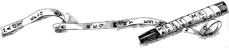

## La escítala

En la antigua Grecia, los espartanos empleaban un curioso método para trasmitir informaciones  confidenciales.  La referencia a este método se encuentra en el tomo  *III* de las *Vidas Paralelas* de Plutarco.  La historia en cuestión no nos interesa.  Solamente debemos saber que los Éforos eran los gobernantes.

> Esto no obstante, los Lacedemonios de todos los demás atentados
suyos se desentendieron, y sólo cuando Farnabazo, ofendido
por él, les taló y asoló el campo y envió a Esparta quien
le acusase, se indignaron los Éforos, quitando la vida a Tórax,
uno de sus amigos y colegas, porque averiguaron que en
particular poseía dinero, y enviando al mismo Lisandro la
escítala, con orden de que se presentase. Lo de la escítala es en
esta forma: cuando los Éforos mandan a alguno de comandante
de la armada o de general, cortan dos trozos de madera
redondos, y enteramente iguales en el diámetro y en el
grueso, de manera que los cortes se correspondan perfectamente
entre sí. De éstos guardan el uno, entregando el otro
al nombrado, a estos trozos los llaman escítalas. Cuando
quieren, pues, comunicar una cosa secreta e importante,
forman una  tira de papel, larga y estrecha como un
listón, y la acomodan al trozo o escítala que guardan, sin que
sobre ni falte, sino que ocupan exactamente con el papel
todo el hueco; hecho esto, escriben en el papel lo que quieren, estando arrollado en la escítala. Luego que han escrito,
quitan el papel, y sin el trozo de madera lo envían al general.
Recibido por éste, nada puede sacar de unas letras que no
tienen unión, sino que están cada una por su parte; pero
tomando su escítala, extiende en ella la cortadura de papel, de
modo que, formándose en orden el círculo, y correspondiendo
unas letras con otras, las segundas con las primeras,
se presente todo lo escrito seguido a la vista. Llámase la tira
escítala, igualmente que el trozo de madera, al modo que lo
medido suele llevar el nombre de la medida.

Para ver en la práctica como funcionaba la escítala imaginemos que tras enrollar la tira escribimos un mensaje formado por 3 filas de  9 caracteres de longitud.  Al desenrollarla obtenemos una tira con 27 letras.  La primera letra de la tira es la primera letra de la primera linea, la segunda letra de la tira es la primera letra de la segunda linea.  Así hasta la tercera letra.  La letra 4 de la tira es la segunda de la primera fila y continuamos hasta el final. En general la j-ésima letra de la i-ésima fila ocupará el lugar 

$$
3(j-1)+i
$$

Veamos ahora un ejemplo de criptograma creado utilizando  una escítala como la  comentada anteriormente.  Como es costumbre en criptografía, el texto al que no se le ha aplicado la criptografía se llama *texto claro* (otros autores lo llaman *texto plano* puesto que en inglés es *plaintext*) y se escribe en minúsculas.  El texto cifrado lo escribiremos en mayúsculas.  También es costumbre en criptografía no escribir los espacios en blanco, ni los signos de puntuación ni de acentuación.  

>*Texto llano*: ejemplodelmetododelescitalo

>|  |  |  |  |  |  |  |  |  |
| --- | --- | --- |--- | --- | --- | ---  | --- | --- | 
|e  |j  | e | m | p | l| o | d | e | 
|l  | m | e | t | o | d| o | d | e |
|l  |  e| s | c | i | t| a | l | o |

>*Texto cifrado*: **ELLJMEEESMTCPOILDTOOADDLEEO**

Para cifrar utilizando este método, si no poseemos la madera en cuestión, podemos seguir los siguientes pasos: 

- Se dibuja una cuadrícula rectangular.

- Se escribe el texto en horizontal, empezando  por la izquierda.

- El texto cifrado se obtiene leyendo en vertical lo que hemos escrito.

El mensaje cifrado depende de las dimensiones de la cuadrícula.

En términos modernos decimos que este cifrado es de  *transposición*, pues a cada letra del texto cifrado le corresponde la misma letra del texto claro.  Lo único que hemos hecho es "desordenarlas" siguiendo un patrón matemático que previamente mencionamos.

El criptoanálisis de este método es muy simple.  Partimos de la primera letra y vamos tomando letras dando saltos de dos letras.  Si obtenemos un mensaje con sentido, resultará que  la escítala tenía únicamente dos líneas.  Si dando saltos de dos letras no conseguimos nada, pasamos a dar saltos de tres letras. Y continuaríamos hasta averiguar cuantas líneas tenía el mensaje.  Luego continuamos con la letra número 2 y finalmente desencriptamos el mensaje.

