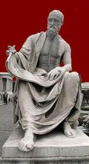
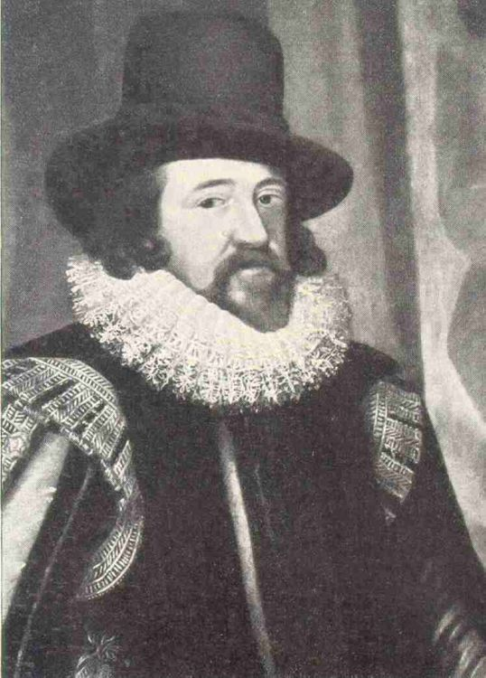

## Polibio

En las películas del oeste, los indios se comunicaban a larga distancia empleando *señales de humo*.  Desgraciadamente de las películas no podemos inferir el significado de las señales basándonos en su forma o duración.

Aunque este método es muy efectivo, en Grecia se empleaba otro todavía mejor. A base de antorchas, los mensajeros podían deletrear palabras y con ello enviar mensajes.  Si el mensajero sostenía tres antorchas en su mano izquierda y dos en su derecha, el receptor era capaz de interpretarlo como cierta letra.  Cambiando la disposición y cantidad de las antorchas, cambiaba también de letra.



En tiempos más modernos se han empleado espejos que reflejaban la luz del sol.  Normalmente con los espejos no se utiliza el código que ahora estudiaremos, sino que se emplea el *Código Morse*. Es una especie de telégrafo óptico. 

El método de Polibio no es considerado por muchos autores como verdadera criptografía, pues su interés no reside en ocultar la información, sino en trasmitirla de un modo más eficaz.  Aun así es interesante su estudio, pues ciertas ideas se utilizan en  criptografía. 


Los métodos de sustitución se basan en asignar a  cada letra otro ente, que puede ser también otra letra, o un número o un símbolo especial.  La cifra de Polibio es históricamente la primera que emplea métodos de sustitución.  Para explicar el funcionamiento en castellano tenemos que recurrir a un truco, debido a que en nuestro idioma se emplean más de 25 letras, cosa que en latín y en griego no ocurre.  Para codificar un mensaje primeramente formamos la siguiente tabla

>|  |  |  |  |  |  |  
| --- | --- | --- |--- | --- | --- | 
|     | A   | B   | C  | D  | E   |
|A    | a   | b   | c  | d  | e   |
|B    | f   | g   | h  | i  | j   |
|C    | k   | l   | m  | n  | o   |
|D    | p   | r   | s  | t  | u   |
|E    | v   | w   | x  | y  | z   |			


La letra *a* se cifrará como *AA*, la *b* como *AB*,...  Hemos eliminado la letra *q*, lo cual no redunda en el contenido del mensaje, siempre que sustituyamos dicha letra por la *k*.  Tampoco hemos incorporado la *ñ* pues nuestra querida letra se suele llevar mal con los ordenadores.

> *Texto claro*: cifradepolibio

> *Texto cifrado*: **ACBDBADBAAADAEDACECBBDABBDCE**

Una de las ventajas del cifrador de Polibio es que emplea únicamente 5 letras para escribir cualquier mensaje, pero tiene un grave problema: el mensaje cifrado tiene el doble de longitud que el texto claro.

Para traducir matemáticamente el cifrador de Polibio, escribimos la tabla con números.  Aunque Polibio escribía las tablas con números del 1 al 5, nosotros lo haremos del 0 al 4, por ser en este caso la interpretación matemática más sencilla.

>|  |  |  |  |  |  |  
| --- | --- | --- |--- | --- | --- | 
|     | 0   | 1   | 2  | 3  | 4   |
|0    | a   | b   | c  | d  | e   |
|1    | f   | g   | h  | i  | j   |
|2    | k   | l   | m  | n  | o   |
|3    | p   | r   | s  | t  | u   |
|4    | v   | w   | x  | y  | z   |


  Para tratar matemáticamente cualquier alfabeto, lo primero que debemos hacer es asociar a cada letra un número entero.  La asociación más habitual es
  
```
a = 0, b = 1, c= 2, ...
```

Observamos que el  número que le asigna la tabla de Polibio a cada letra es precisamente el número de la letra escrito en base 5. Luego el cifrador de Polibio, en su versión númerica, consiste en traducir los números  a base 5.  Debemos tener cuidado, pues si queremos, por ejemplo, escribir el número cuatro en base cinco, lo debemos escribir como *04*.


Polibio utilizo la base 5 debido a que era el cuadrado que mejor se adaptaba a su alfabeto.  En un lenguaje donde el alfabeto tuviera 98 letras distintas, deberíamos elegir una tabla de 10 por 10.


Un método similar al de Polibio fue propuesto por el filósofo inglés del siglo *XVI* Francis Bacon. En el método de Bacon, a cada letra del alfabeto se le asocia una secuencia de cinco letras, siendo estas letras únicamente la *A* y la *B*. La asociación comienza así:

```
a = AAAAA, b = AAAAB, c = AAABA, d = AAABB, ...
```




Si sustituimos la *A* por cero y la *B* por uno, observamos que lo único que hacemos es escribir cada letra en lenguaje binario.  Como la quinta potencia de 2 es 32, existen suficientes símbolos para codificar todas las letras, incluso en castellano. Aun así nos sobran símbolos que podemos utilizar para otros menesteres.


> *Texto claro*: bacon

> *Texto cifrado*: **AAAABAAAAAAAABAABBABABBAA**


El método de Bacon era fácilmente descifrable por cualquier persona con un poco de ingenio.  Por ello Bacon lo utilizaba junto con una técnica esteganográfica: escribía cualquier texto, pero unas letras las hacía  de una forma (modernamente diríamos que empleaba un tipo de letra) ligeramente diferente de las otras, de tal forma que solo un ojo muy entrenado notaba la diferencia.  Si la letra era de un tipo, significaba A y si era de otro tipo significaba B.


> *Texto claro*: bacon

> *Texto cifrado*: y poc**a**s son las g**r**ut**as** d**e**c**or**adas


Esta idea de Bacon, se utiliza  en los ordenadores. El código ASCII asigna un número entre 0 y 255 a muchos caracteres que utilizamos habitualmente.  Para poder manejar dichos números, el ordenador lo que hace es que lo traduce a su lenguaje, que es la base 2.  De este modo podemos entender que el código ASCII es una generalización de las ideas de Polibio y Bacon. 


