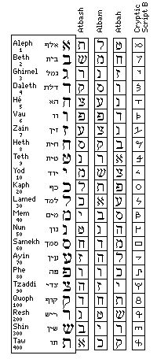

## Los hebreos

La cábala judía asocia a cada letra del alfabeto hebreo un número. Manipulando dichos números con reglas matemáticas se pretende descubrir importantes secretos, estudiando cabalísticamente el texto sagrado judío por excelencia, la *torá*.  La torá está formada por los cinco primeros libros de la biblia, (el *Pentateuco*) que según la tradición judía, fueron escritos directamente por Dios.  La creencia de que Dios codificó información importante en la biblia ha sido una constante a lo largo de la historia.  El mismo Newton creía en ello y le dedicó grandes esfuerzos, aunque no sabemos con que éxito.  Actualmente existen programas de ordenador que pretenden obtener profecías, analizando númericamente la biblia. El libro de Michael Drosnin, *El código de la Biblia*, que presenta uno de esos programas, ha sido un verdadero best-seller en todo el mundo a finales del siglo *xx*.

El pueblo judio siempre ha sido amigo de este tipo de estudios que rayan con lo esotérico.  Empleaban también en sus escritos distintos  métodos criptográficos, pero más como un medio de dar un aura de misticismo, que con el proposito de ocultar información.  De todos los métodos que empleaban el más conocido es el *atbash*, ya que aparece en la biblia, en concreto en el libro de Jeremías, donde el nombre de la ciudad de Babel se codifica como Sesac (se debe tener en cuenta que en hebreo antiguo no se escribían las vocales)

El *atbash* sustituye la primera letra del alfabeto por la última, la segunda por la penúltima y así sucesivamente.  Empleando un alfabeto latino de 26 letras (quitamos la *ñ*), podemos poner un ejemplo.

> *Texto llano*: elcodigodelabiblia

> *Texto cifrado*: **VOXLWRTLWVOZYRYORZ**

Para descifrar el mensaje debemos volver a codificarlo.  Este tipo de métodos, que emplean exactamente las misma reglas para descifrar que para cifrar, se llaman *involutivos*.

Otro método de codificación era el *Albam*.  Lo explicamos en el caso de un alfabeto de 26 letras.  La primera letra se sustituye por la letra que ocupa la posición 14, la segunda por la que ocupa la posición 15 y así sucesivamente. La letra 14 se sustituye por la primera, la letra 15 por la segunda, etc.

> *Texto llano*: elcodigodelabiblia

> *Texto cifrado*: **RYPBQVTBQRYNOVOYVN**

De nuevo estamos ante un cifrado involutivo. Ya veremos que guarda gran similitud con el método que empleaba el emperador Julio César.

Existen otros métodos de codificación, pero todos ellos se basan en la misma idea: sustituir unas letras por otras, o sustutuir letras por símbolos.  En la figura  se pueden observar 4 métodos de codificación utilizando el propio alfabeto hebreo, así como el número cabalístico asociado.

