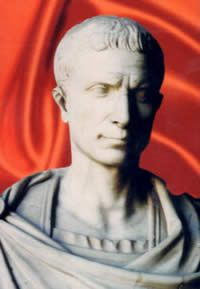

## Julio César

Julio César es considerado por muchos el mayor genio militar de la historia.  El mundo de la guerra siempre ha echado mano de la criptografía y grandes avances en este campo se deben a problemas de índole militar. El escritor romano Suetonio, en su libro *Doce Césares*, nos informa del método de cifrado de César.  Este es un extracto donde Suetonio habla de los  escritos de César.

>... Existen también sus cartas al Senado, y fue al parecer el primero en escribir sus comunicaciones en hojas dobladas en forma de oficio, pues hasta entonces las habían escrito los cónsules y generales en toda la extensión de la hoja. Se conservan, por último, sus cartas a Cicerón, así como las que escribió a sus amigos acerca de sus asuntos domésticos. Para los negocios secretos utilizaba una manera de cifra que hacía el sentido ininteligible, estando ordenadas las letras de manera que no podía formarse ninguna palabra; para descifrarlas tiene que cambiarse el orden de las letras, tomando la cuarta por la primera, esto es d por a, y así las demás. 

En el mismo libro también nos habla Suetonio de la relación de otro emperador, Augusto, con la ortografía y del método de cifra que utilizaba este emperador romano

> No observó mucho la ortografía, es decir, la forma y razón establecidas por los gramáticos para escribir, y parece que opinaba como los que desean que se escriba como se habla. Error muy extendido es omitir o invertir letras y silabas, y no hablaría de ello si no hubiese leído con sorpresa, en algunos autores, que reemplazó como ignorante y ordinario a un legado consular por haber escrito *ixi* por *ipsi*. Cuando escribía en cifra ponía la b por a, c por b y así con las otras letras; por x ponía dos a.

Despues de leer a Suetonio tenemos claro como cifraba César.  Utilizaba un método de sustitución que consistía en cambiar cada letra, por otra situada tres lugares más adelante.  A las tres últimas letras le hace corresponder las tres primeras del alfabeto. En el idioma castellano, el alfabeto cifrado es

>|  |  |  |  |  |  |  |  |  |  |  |  |  | 
| --- | --- | --- |--- | --- | --- | ---| --- | --- | --- |--- | --- | --- | 
		a|b|c|d|e|f|g|h|i|j|k|l|m
		 D|E|F|G|H|I|J|K|L|M|N|O|P
	
>|  |  |  |  |  |  |  |  |  |  |  |  |  | 
| --- | --- | --- |--- | --- | --- | ---| --- | --- | --- |--- | --- | --- | 	 
		n|o|p|q|r|s|t|u|v|w|x|y|z
		 Q|R|S|T|U|V|W|X|Y|Z|A|B|C

Utilizando la tabla anterior podemos cifrar y descifrar cualquier mensaje escrito utilizando la cifra de César.

> *Texto claro*: lacifradecesar

> *Texto cifrado*: **ODFLIRDGHFEVZAR**

En este caso nos hemos desplazado 3 letras hacia la derecha.  Podríamos tomar otro número distinto de 3 y obtener otro cifrado distinto.  

Si sabemos que un texto está cifrado con el método de César, para criptoanalizarlo debemos escribir, como mucho, 26 mensajes, desplazando en cada mensaje un número de letras.  Alguno de estos 26 mensajes es el texto en claro.  Este método de escribir todos los posibles textos en claro asociados al texto cifrado se conoce como *ataque por fuerza bruta*.  

A nivel matemático, el cifrado de César se entiende perfectamente trabajando en el grupo aditivo $\mathbb{Z*_{26*$. Si en el texto claro la letra tiene asignado un número $i$, la letra cifrada tiene asignado el número $i+3$, donde la suma se realiza modularmente (por ejemplo $25+3=2$).

Como vemos, criptoanalizar el cifrado de César es sencillo.  Los criptógrafos han tenido que inventar  métodos que generalicen el empleado directamente por César.  Uno de ellos es el *cifrado de César con clave*.  Para ello tomamos una palabra o frase arbitraria.  A la letra $a$ le asignamos la primera letra de la palabra clave.  A la $b$ le asignamos la segunda letra de la clave, a no ser que ésta coincida con la primera letra de la clave, en cuyo paso nos pasamos a la tercera y así sucesivamente.  Cuando terminemos con las letras de la clave, empezamos a colocar el resto de las letras en orden alfabético.  Lo mejor para comprenderlo es un ejemplo.  Tomemos como frase clave "elcesar". El alfabeto cifrado es entonces

>|  |  |  |  |  |  |  |  |  |  |  |  |
| --- | --- | --- |--- | --- | --- | ---| --- | --- | --- |--- | --- | 
		|l|c|c|c|c|c|c|c|c|c|c|c|
		*Alfabeto claro*:|a|b|c|d|e|f|g|h|i|j|...
		*Alfabeto cifrado*:|E|L|C|S|A|R|B|D|F|G|....
			
También podemos colocar la frase clave $k$ lugares a la derecha, sobre todo si observamos que alguna letra se codifica como ella misma.

El método de César más general es aquel en el que efectuamos una permutación arbitraria de las 26 letras del alfabeto.  Como existen $26!$ permutaciones distintas de un conjunto de 26 elementos, existen una gran cantidad de cifras distintas.  Si para cifrar utilizamos una permutación $\sigma$, para descifrar el mensaje debemos utilizar la permutación $\sigma^{-1}*$.

Para criptoanalizar un texto cifrado por el método de la fuerza bruta debemos escribir $26!$ textos distintos (uno para cada permutación) y de esa manera estamos seguros que alguno de los textos es el mensaje en claro.  Este método es inviable en la práctica, puesto  $26!$ es del orden de $10^{27}*$, que es un número enorme.

Durante muchos siglos la cifra de César con clave resistió ante los criptoanalistas.  Debemos esperar al apogeo de la cultura árabe en la que el matemático *Al Kindi* inventa el método del *análisis de frecuencias*, con el que es relativamente sencillo resolver el problema.

>|   |   |   |   |   |   |   |   |   |   |   |   |   | 
 | - | - | - | - | - | - | - | - | - | - | - | - | - | 
 | a | b | c | d | e | f | g | h | i | j | k | l | m |
 | D | E | F | G | H | I | J | K | L | M | N | O | P |
	
>|   |   |   |   |   |   |   |   |   |   |   |   |   | 
 | - | - | - | - | - | - | - | - | - | - | - | - | - | 
 | n | o | p | q | r | s | t | u | v | w | x | y | z |
 | Q | R | S | T | U | V | W | X | Y | Z | A | B | C |
