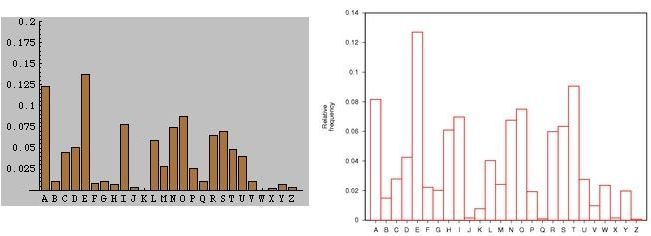
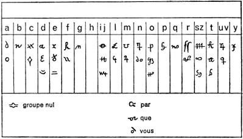

## El análisis de frecuencias

Hasta ahora todos los métodos de cifrado que hemos analizado eran de tipo *monoalfabético*.  En estos métodos tenemos dos alfabetos: uno que se emplea en el texto claro y otro que se emplea en el criptograma.  En muchas ocasiones ambos alfabetos coinciden. Lo que caracteriza a los métodos de cifrado monoalfabéticos es que el símbolo asociado a un determinada letra no cambia en toda la extensión del criptograma.  Por ejemplo, si ciframos la letra $a$ utilizando la letra $H$, en todo el criptograma, debemos sustituir $a$ por $H$.

Hasta bien entrada la Edad Media estos métodos se consideraban suficientemente seguros. Pero en el siglo *ix* un matemático árabe, que trabajaba en la *Casa de la Sabiduria* de Bagdag, escribe un libro, *Manuscrito sobre el desciframiento de mensajes criptográficos*. El nombre de este árabe es ni más ni menos que *Abu Yusuf Yaqub ibn Ishaq al-Sabbah Al-Kindi*, pero nos referiremos a él simplemente como  Al-Kindi. En su libro describe un método, *el análisis de frecuencias*, que permite "romper" todos los cifrados monoalfabéticos. Dejemos que al-Kindi nos exponga someramente su método.

> Una manera de resolver un mensaje cifrado, si sabemos en qué lengua está escrito, es encontrar un texto claro diferente escrito en la misma lengua y que sea lo suficientemente largo para llenar alrededor de una hoja, y luego contar cuántas veces aparece cada letra.  A la letra que aparece con más frecuencia la llamamos "primera", a la siguiente en frecuencia la llamamos "segunda", a la siguiente "tercera", y así sucesivamente, hasta que hayamos cubierto todas las letras que aparecen en la muestra de texto claro.

> Luego observamos el texto cifrado que queremos resolver y clasificamos sus símbolos de la misma manera.  Encontramos que el símbolo que aparece con más frecuencia y lo sustituimos con la forma de la letra "primera" de la muestra de texto claro, el siguiente símbolo más corriente lo sustituimos por la forma de la letra "segunda", y el siguiente en frecuencia lo cambiamos por la forma de la letra "tercera", y así sucesivamente, hasta que hayamos cubierto todos los símbolos del criptograma que queremos resolver.

Para poder aplicar el análisis de frecuencias, necesitamos conocer cual es el porcentaje de aparición de cada letra en los textos en claro.  Naturalmente este porcentaje depende del idioma en el que sospechamos que está escrito el mensaje.
 
 
La aplicación directa del método de Al-Kindi casi nunca descifra un criptograma, pero si suele suceder que las letras que más aparecen en el criptograma son las de mayor frecuencia del idioma.  Esto ya nos ofrece bastante información.  Del mismo modo se puede hacer una estadística de los digramas (formados por dos letras) del idioma. Esto también ayuda a descifrar.  Además de esto podemos tener en cuenta las características propias de cada letra: por ejemplo, la *q* en castellano va siempre seguida de una *u*, la letra *x* suele ir precedida de la letra *e*...  Las letras con características tan evidentes son una perdición para cualquiera que quiera utilizar una cifra monoalfabética.  Por ello, muchos criptógrafos nunca utilizan la *q*, sino que emplean la *k* y todas las *x* las sustituyen por *s*.  Aunque el mensaje en claro tenga faltas de ortografía, su sentido se recupera fácilmente.
 
 
| | | | | | |
| --- | --- | --- | --- | --- | --- |
	a| 10.60|j|0.25| r| 0.74
	b|1.16|k|0.11| s|8.47
	c|4.85|l|4.42|t|5,40
	d|5.87|m|3.11|u|4,34
	e|13.11|n|7.14|v|0.82
	f|1.13|ñ|0.10|w|0.12
	g|1.40| o|8.23|x|0.15
	h|0.60|p|2.71|y|0.79
	i|7.16|q|0.74|z|0.26
	

 
El fallo más evidente del método de al-Kindi se tiene en la novela *La disparition* de Georges Perec.  Esta obra, escrita en francés, no emplea nunca la letra *e*, que es de las más corrientes en dicho idioma.
 
Un ejemplo del método de análisis de frecuencias se puede encontrar en el libro de Edgar Allan Poe *El escarabajo de oro*. Aunque el libro puede encontrarse  en español, el criptograma que descifra su protagonista se encuentra en inglés.  
 
 
En otros idiomas las frecuencias son distintas.  Algunos emplean, con pequeñas variaciones, nuestro mismo alfabeto, pero hay muchos idiomas con un alfabeto completamente diferente, y con reglas ortográficas totalmente distintas (por ejemplo el chino se escribe en vertical y utiliza habitualmente más de 3000 caracteres).

 
Una vez que se vió que el análisis de frecuencias permitía criptoanalizar textos, los diseñadores de códigos inventaron algo nuevo: los *nulos*.  Estos son caracteres que no están asociados a ninguna letra y se reparten aleatoriamente por el texto para modificar las frecuencias.  Este truco tampoco funcionó y un buen criptoanalista detecta rápidamente los nulos de los criptogramas.  

Viendo que los nulos no entorpecían mucho la labor de los rompedores de códigos, y que sin embargo alargaban de manera innecesaria los mensajes, se busco otra solución:  los *homófonos* (del griego *homo*, que significa igual y *phonos* que significa sonido).  Si la letra e aparece un trece por ciento de los casos, podemos hacer corresponder a esta letra, en vez de un solo símbolo, trece símbolos distintos.   Cada uno de estos trece símbolos se debe emplear de manera aleatoria al cifrar el texto.  Si hacemos esto con cada una de las letras, resultará que  todos los símbolos tendrán una frecuencia similar.  Además, si alguno aparece con más probabilidad no podemos estar seguros de que esté asociado a letras con un porcentaje mayor.  

El método de los homófonos también era atacable por el análisis de frecuencias.  Llego el momento en que todas  las cifras monoalfabéticas eran demasiado débiles para resistir cualquier ataque.  Se tuvo que avanzar un peldaño más en el arte de la criptografía y empezar a diseñar cifrados polialfabéticos.

