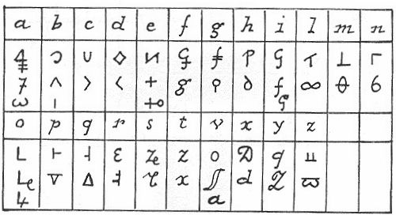
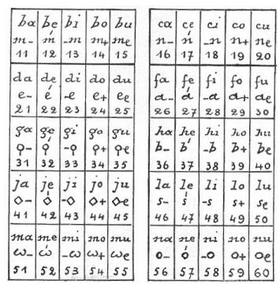
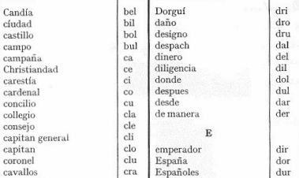

## La Cifra General

En el siglo *xvi* era común que todos los gobernantes  utilizaran algún método de cifrado, sobre todo si el  mensaje debía atravesar algún territorio extranjero. La comunicación con los embajadores, y en general toda la diplomacia, utilizan de modo cotidiano la criptografía.  En tiempos de Felipe *ii* el método criptográfico más en boga era el de sustitución, aunque con una serie de aditamentos.  Trataremos aquí la conocida como *La Cifra General* que fue la primera que utilizó Felipe *ii*. Está fechada en 1556 y su original se conserva en el *Archivo de Simancas*.  

Analicemos en detalle este método de cifrado, que consta de tres partes bien diferenciadas.

- La primera es una tabla de sustitución con homófonos: cada consonante tiene dos homófonos y cada vocal tres.

- Un método de sustitución para sílabas, también denominado  *silabario*.  Cada sílaba se puede sustituir por símbolos o por un par de números. Como se trabajaba con 130 sílabas, las últimas no tienen asociado un par de números, sino simplemente los símbolos. 

Se puede observar la gran simetría que presenta el silabario.  Cada parte de la sílaba se sustituye por un símbolo y la vocal que le acompaña es otro símbolo de menor tamaño. El símbolo de la vocal es siempre el mismo en todas las sílabas.  En la parte númerica se observa también un patrón fijo (por ejemplo, los números terminados en 3 y 8 están asociados a la letra $i$).

- Un libro de  códigos que sustituía palabras enteras.  Eran palabras comunmente usadas en aquella época en los mensajes diplomáticos. En total el libro constaba de 385 palabras.

Para cifrar cualquier palabra se puede utilizar la sustitución monoalfabética, o bien el silabario, o también una mezcla de las dos.  Además, si la palabra estaba en el libro de códigos, se utiliza el código asociado.

El criptoanálisis de este método de cifrado es relativamente sencillo.  A los tres meses de ponerse en circulación, ya había sido criptoanalizada con éxito.  Y es que esta cifra presenta muchos problemas de diseño. Parece claro que el creador de esta cifra no era ningún entendido en la materia.  Cualquier persona acostumbrada a romper códigos sería consciente de las debilidades de esta cifra. Ya hemos comentado algunas debilidades del silabario.  Si todo el texto se cifra utilizan únicamente el silabario, prácticamente nos están diciendo todas las vocales del texto.  Con esto cualquier persona sin preparación puede descifrar un texto.  Pero el método de homófonos presenta problemas similares. Un buen método de homófonos tiene en cuenta la frecuencia de las letras: a mayor frecuencia, mayor número de homófonos.  Por guardar la simetría y hacer un diseño *estéticamente correcto* la Cifra General no  oculta la frecuencia de las letras y se puede hacer un ataque por un análisis de frecuencias. 

Los servicios de contraespionaje español pronto descubrieron que Francia había roto la cifra de Felipe *ii*.  El responsable de tamaña afrenta al rey español fue  *Francois Viète*, conocido en la actualidad por ser un gran matemático.  Pero entre sus virtudes también contaba con ser un esplendido criptoanalista, y descifró sin gran problema la cifra española.  Como Felipe creía que su cifra era perfectamente segura, estaba convencido que nadie era capaz de descifrarla, a no ser que fuera contando con la ayuda del *Maligno*.  Con esta fe que caracterizaba al rey español, denunció ante el Papa al rey de Francia acusándolo de utilizar magia negra y de tener pactos con el diablo, pues era el único modo posible de reventar su sistema de cifrado.  Pero el papa también tenía un gabinete de cifras y  hacía tiempo que era capaz de leer la cifra de Felipe *ii*.  Este hecho fue conocido   y el rey más poderoso de su época quedo en ridículo.  Al cabo de seis años la Cifra General fue cambiada. 

