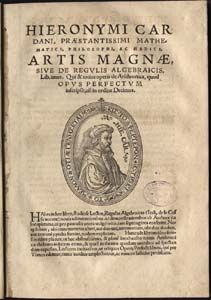
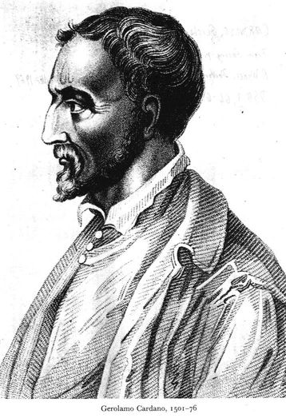
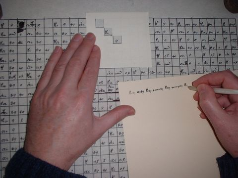

## Cardano

La paternidad del método que resuelve la ecuación de tercer grado ha sido muy controvertida en el devenir histórico.  Se conoce hoy como *fórmula de Cardano*, aunque ya Cardano reconocía que otros  autores la conocían con anterioridad.  Pero le cupo a Cardano el honor de ser el primero en publicarla, en su obra *Ars Magna*.

Para entender la reticencia a la publicación de sus conocimientos por los matemáticos  del Renacimiento, debemos ponernos en situación. El modo de conseguir un trabajo en una universidad o bien el mecenazgo de algún señor, era demostrar públicamente la valía del científico. Era normal que dos científicos se retasen públicamente, bien en un debate, bien resolviendo problemas o de cualquier otro modo.  En el caso de los problemas, cada matemático proponía problemas a su contrincante.  El conocimiento de algún recurso matemático desconocido por el oponente era una gran ventaja.

La versión actualmente más aceptada por los historiadores de la matemática dice que el primer mortal que descubrió la fórmula fue un profesor de la universidad de Bolonia, Scipione del Ferro. El método no resolvía la ecuación general sino las ecuaciones del tipo

$$
x^3+px+q=0
$$

que hoy se llaman *reducidas*.  Durante su vida no confesó su secreto a nadie, pero en el lecho de muerte, le transmitió su sabiduría a su discípulo Antonio Fiore. Nicolo Fontana, más conocido como *Tartaglia*, se vanarogliaba  de ser un gran matemático (y en efecto lo era). Hubo un reto público entre Fiore y Tartaglia.  Cada uno enviaría 30 problemas al otro.  El perdedor debía pagar una cena al vencedor y a tantos invitados como problemas hubiera resuelto el campeón.  Todos los problemas  propuestos por Fiore se basaban en la ecuación de tercer grado.   Tras un duro trabajo, la noche antes de finalizar el plazo, en un momento de inspiración, Tartaglia descubre el método que resuelve la ecuación cúbica reducida.  Esa misma noche resuelve los 30 problemas.  En cambio Fiore no resolvió prácticamente ninguno de los propuestos por Tartaglia, que eran mucho más variados.

Entretanto Cardano era ya un médico famoso.  Se entrevista con Tartaglia y le insta a que le revele el secreto de su fórmula, pues Cardano tiene intención de publicar un libro sobre álgebra y desea incluir el método de Tartaglia.  Aunque durante mucho tiempo Tartaglia se resiste, finalmente accede  a los ruegos de Cardano, pero bajo juramento de que no sea publicado ni comunicado a nadie. Este es un extracto del juramento de Cardano:

> Os juro sobre los Santos Evangelios, que si me comunicáis vuestros descubrimientos no los publicaré jamás y los anotaré sólo para mí en cifra, a fin de que nadie pueda comprenderlos hasta después de mi muerte.

Finalmente Cardano no pudo resistir la tentación de publicar el secreto, aunque según él tenía una buena excusa: tras estudiar los escritos de del Ferro, consiguio encontrar la fórmula.  Según Cardano  el método que publicó era el de del Ferro y no se sentía obligado a respetar el juramento.

No sabemos que sistema criptográfico tenía pensado utilizar Cardano para evitar que nadie fuese capaz de leerlo, pues el método criptográfico que habitualmente utilizaba era más bien débil.  Tomaba Cardano una plantilla rectangular y cuadriculada con varias casillas huecas.  Se coloca encima del papel, y utilizando las casillas huecas, se escribe el mensaje.  Después se retira la plantilla y se rellena al azar el resto.  Para descifrar el texto simplemente debemos poner nuevamente la plantilla sobre la hoja de papel.

Este método tan sencillo también sería utilizado posteriormente por el Cardenal Richelieu, pero él camuflaba sus mensajes en textos que si tenían sentido gramatical, aunque no transmitían ninguna información importante.

