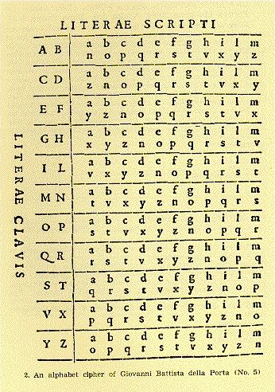
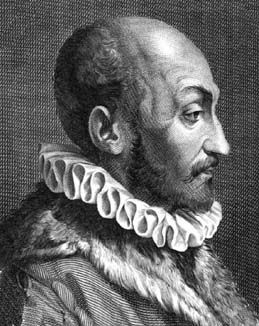

## Della Porta

Giovanni Battista Della Porta  es un famoso científico italiano.  En el ámbito de la criptografía su obra más importante data del 1563 y es *De Furtivis Literarum Notis*, compendio de cuatro volumenes donde además de estudiar los cifrados clásicos y su criptoanálisis, expone también un nuevo método de cifrado.  La característica principal de este método es la utilización de distintos alfabetos y de una palabra clave.  El *cifrado de Porta*  original emplea 11 alfabetos distintos. La  palabra clave  nos permite conocer en todo momento cual es el alfabeto que debemos emplear. En el caso del idioma español se deben utilizar 13 alfabetos distintos (pues utilizamos 26 letras) que se construyen  de modo análogo al que utilizó nuestro personaje para el latín.

	
Para la explicación del método utilizaremos los alfabetos originales. Supongamos que la palabra clave es PORTA.  Si queremos cifrar cualquier mensaje la primera letra del mensaje está asociada a la letra clave *P*, la segunda a la *O*,... La sexta vuelve a estar asociada a la *P*.

Cada alfabeto tiene dos letras que le dan nombre.  Si la letra clave es *P*, utilizamos para cifrar el alfabeto que tiene la letra *P* en su nombre (en nuestro caso es el séptimo alfabeto).  Cada letra de la primera fila la sustituimos por la letra que tiene debajo en dicho alfabeto.  Si la letra que queremos codificar se encuentra en la segunda linea la sustituimos por la letra que se encuentra encima. Por una casualidad el alfabeto asociado a la *O* vuelve a ser el mismo, pero ya el asociado a la *R* es distinto (es el octavo).

> *Texto llano*: lacifradeporta

> *Clave*: PORTA

> *Texto cifrado*: **QSTNSMSVVCHMCQ**

Para recuperar el texto cifrado simplemente empleamos el mismo método que para cifrar y utilizamos naturalmente la misma clave.

	
