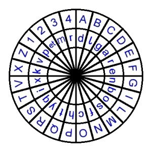

## Alberti

Leon Battista Alberti fue uno de los ejemplos de "homo universalis" del Renacimiento. Fue poeta, compositor, pintor, pero sobre todo es conocido como arquitecto. En el mundo de la criptografía su aportación más importante es *De Componendis Cyphris*, escrito en 1466 (aunque fue publicado un siglo más tarde). Es el libro sobre criptografía más antiguo que se conoce en el mundo occidental. Analiza en este libro los cifrados monoalfabéticos explicando el análisis de frecuencias.   Históricamente es el primero en proponer los cifrados polialfabéticos.  Aparte de esto, propone un nuevo método de cifrado de su invención que utiliza el ahora conocido como *disco de Alberti*.

> Hago dos discos con dos láminas de  cobre.  Uno, el mayor, será fijo y el otro móvil.  El diametro del disco fijo será superior en un noveno al disco móvil.  Divido la circunferencia  de los discos en 24 partes iguales llamadas sectores.  En cada uno de los sectores del disco grande escribo en orden alfabético normal una letra mayúscula roja: primero la A, seguida de la B, despues la C, etc, omitiendo H y K que no son indispensables

Como en latín no existen las letras $J,U,W,Y$,  rellena por este método solamente 20 sectores.  En los otros cuatro escribe los números $1,2,3,4$.  Prosigue con su relato de como rellenar el disco pequeño.

> ... una letra minúscula, pero no en su orden normal como en el disco fijo, sino en un orden incoherente.  De esta forma se puede suponerse que la primera letra será la $a$, la segunda la $g$, tercera la $q$ y así hasta rellenar los 24 sectores, porque el alfabeto latino consta de 24 caracteres, siendo el vigésimocuarto *et*.  Efectuadas estas operaciones, se coloca el disco pequeño sobre el grande de modo que una aguja pasada por los dos centros sirva como eje común alrededor del cual girará el disco móvil.

Ahora tomamos en el disco pequeño una letra clave, por ejemplo la $k$.  Esta letra la alínea con una cualquiera de las letras exteriores, por ejemplo con la B, e informa de esta letra al receptor del mensaje

> ... Usando este punto de partida, cada letra del mensaje representará a la letra fija que hay sobre ella.  Despues de escribir tres o cuatro letras, puedo cambiar la posición de la letra clave de modo que la $k$ esté, por ejemplo, sobre la D.  Despues en mi mensaje escribo una D mayúscula y, a partir de este punto, $k$ ya no significará $B$ y si $D$, y todas la letras del disco fijo tienen nuevas identidades.

El resultado de la explicación de Alberti puede observarse en la  figura. Utilizando esta figura procedemos a dar un ejemplo. Para seguir las indicaciones de Alberti, en este caso escribimos en mayúsculas el texto claro. 	La letra clave que alinearemos será la *k*.

	

> *Texto llano*: LEONBATTISTAALBERTI

> *Texto cifrado*: XorcfAvkfflfkNoishmdq

El método de cifrado de Alberti presenta una clara ventaja: no es posible atacarlo con el análisis de frecuencias.  Pero aun así tiene inconvenientes graves.  Para poder desencriptar el mensaje el receptor necesita un disco exactamente igual al que sirvió para crear el cifrado. No vale cualquier disco con una distribución arbitraria de las letras.  Otro problema, es que si alguien posee un disco igual al que creó el criptograma, lo descifraría con facilidad.  La seguridad de este cifrado depende de mantener secretos los discos.  En la actualidad esto se considera una falta grave de cualquier método de cifrado.

Pero el interés de la cifra de Alberti es más bien teórico.  Es el primero que utiliza un cifrado *polialfabético*.  Esto quiere decir que a lo largo del mensaje se cambia de alfabeto.  Por ejemplo, durante una parte del cifrado la letra $a$ se puede codificar como $H$, pero en otra parte se codificará con otra letra distinta.  Esta idea germinal del cifrado polialfabético será explotada por nuestro siguiente personaje.