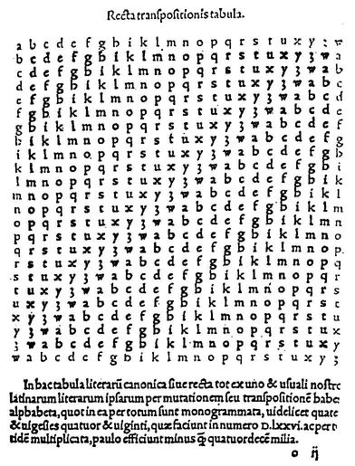

## Vinegère y sus variantes

Blaise de Vigenère fue un diplomático francés del siglo *xvi*.  En sus trabajos como diplomático entró en contacto con el mundo de la criptografía y una vez retirado de su carrera, dedicó gran parte de su tiempo a este arte.  En 1586 publica el libro *Traité des chiffres où secrètes manières d'escrire*. En él expone su nuevo método de cifrado, que está basado en la cifra de César y utiliza las ideas de Alberti.  Imaginemos que ciframos la primera letra con un método de César de desplazamiento 3, la segunda letra con un desplazamiento 7, y en general todas las letras con un desplazamiento arbitrario.  Este método resiste el análisis de frecuencias, pues cada letra se codifica de muchas formas distintas.  Pero claro, si cambiamos arbitrariamente la cifra de César, ni nosotros mismos vamos a ser capaces de descifrarla.  Para ello Vigenère utiliza el concepto de *palabra clave*. Imaginemos que nos dan la clave VIGENERE.  Si queremos cifrar un mensaje con esta clave procedemos del siguiente modo. Para cifrar la primera letra utilizamos el alfabeto de César que comienza por V.  Para cifrar la segunda letra utilizamos el alfabeto que comienza por I, la tercera con la G...   De este modo llegamos a la octava letra.  Para la novena volvemos a utilizar el alfabeto de la V.  En  este ejemplo hemos utilizado 5 alfabetos distintos.  Eligiendo otras palabra (o frases) clave, podemos variar mucho el resultado del criptograma.

	
Para la realización práctica de este cifrado se utiliza una tabla que consta de todos los alfabetos que podemos utilizar.  También se puede utilizar un disco de Alberti especialmente adaptado.

Para complicar más el criptoanálisis del método de Vigenère se deben elegir claves mas bien largas y con pocas letras repetidas.  Cuantos más alfabetos empleemos, más difícil será realizar el criptoanálisis.

> *Texto llano*: lacifradevigenere

> *Clave*: VIGENERE

> *Texto cifrado*: **GIIMSVRHZDOKRRVVZ**

La implementación en ordenador de este método o de su estudio matemático se realiza utilizando la aritmética modular.  De la palabra clave, tomamos los números asociados. A cada letra del texto claro le debemos sumar, modularmente, las letras de la clave.

A pesar de la potencia de este método de  cifrado, realmente tardó mucho en aplicarse, fundamentalmente debido a la laboriosidad del método.  Sin embargo resistió durante muchos siglos los intentos de criptoanálisis.  Tanto es así que llegó a ser conocida como "Le chiffre indéchiffrable".

En el siglo *xix* dos personajes, de modo independiente, lograron "romper" la cifra de Vigenère. Uno de ellos es el polifacético *Charles Babbage*, que hoy es conocido fundamentalmente por sus diseños de máquinas mecánicas que presentaban todos los elementos clave de los ordenadores.  El otro fue un militar prusiano, Kasiski. Buscando repeticiones de patrones, si el cifrado es lo suficientemente largo, se puede intuir la longitud de la clave.  Si por ejemplo, la clave tiene 8 caracteres, resultará que las letras que ocupan las posiciones 1,9,17,...  se habrán cifrado con el mismo alfabeto.  A este alfabeto se le puede aplicar el análisis de frecuencias y desencriptar el mensaje.

En el pasado,  el cifrado de Vigenère utilizaba una tabla  donde aparecen listados todos los posibles alfabetos. Es lo que se conoce como *tabla de Vigenère*.  Pero resulta que dicha tabla ya la empleó Tritemius en su obra *Polygraphia*, aunque éste la denominaba *tabula recta*.  Sin embargo el método de cifrado que empleaba Tritemius era más sencillo. Para cifrar la primera letra utilizaba la primera línea (un cifrado de Cesar con desplazamiento nulo), para la segunda letra utilizaba la segunda línea (ahora un cifrado de Cesar con desplazamiento unidad)... Al llegar a la última línea volvía a empezar por la primera.
Esto equivale a utilizar el cifrado de Vigenère con una palabra clave formada por el alfabeto completo.

> *Texto llano*: latabularectadetritemius

> *Texto cifrado*: **LBVDFZRHZNMEMQSIHZLXGDQP**

Otra variante del cifrado de Vigenère es el *cifrado Gronsfeld*.  Este cifrado utiliza únicamente las 10 primeras líneas de la tabla, que se numeran del 0 al 9.  En este caso la palabra clave es un número, por ejemplo el 768902, que nos indica que debemos cifrar la primera letra con la fila 7, la segunda con la fila 6...

> *Texto llano*: elcrifradogronsfeld

> *Clave*: 768902

> *Texto cifrado*: **LRKAIHYGLXGTVTAOENK**

El  almirante inglés Sir Francis Beaufort inventó otro cifrado que utiliza también la tabla de Vigenère y una palabra clave. Pero el *cifrado de Beaufort* emplea un método de codificación es ligeramente distinto. Imaginemos que la clave es BEAUFORT y que el texto a cifrar es "estemetodoesunavariante". Tomamos la primera letra del texto claro, la $e$ y calculamos su número asociado. A la letra $e$ le corresponde el 4. Entonces restamos 4 a la primera letra de la clave.  Resulta que $b-4=X$. Seguimos el mismo procedimiento con el resto de las letras.

Descrito de este modo matemático, el método de Beaufort parece de una gran complicación.  Sin embargo, existe un método más intuitivo para realizar este cifrado.  Tomamos la primera letra del mensaje en la primera fila.  Bajamos por la columna de dicha letra hasta encontrar la letra de la clave que le corresponde. Después nos desplazamos por la línea de la letra clave hasta su comienzo y esa es precisamente la letra que le asigna el método de Beaufort.

> *Texto llano*: estemetodoesunavariante

> *Clave*: BEAUFORT

> *Texto cifrado*: *XMHQTKYFYQWCLBRYBNSUSVN*

Existe otro método de codificación distinto, que normalmente se llama la *variante alemana* del método de Beaufort. Para no recargar el texto no la describiremos. 