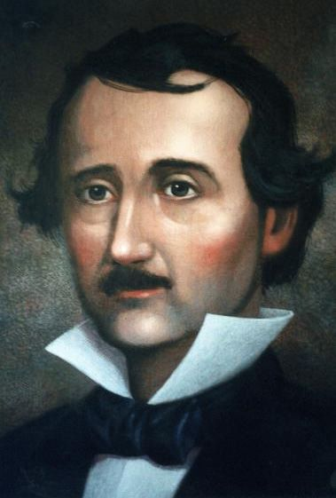
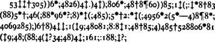

## Edgar Allan Poe

Todos los aficionados a los cuentos de terror conocen el nombre de Edgar Allan Poe.  Probablemente junto a H. P. Lovecraft es el autor de relatos de miedo más famoso de la historia.  Los adictos a su lectura son legión.  También es sobradamente conocida la obra poética de Poe, con poemas tan famosos como *Anabbel Lee*.  

	
Sin embargo mucho menos conocida es la pasión de Poe por la criptografía. Durante mucho tiempo Poe ejerce la profesión de periodista y publica muchos artículos en revistas y periódicos. En una de ellas reta  a sus lectores a que le envien criptogramas que el resolverá. Le enviaron aproximadamente un centenar.  Casi todos cayeron bajo el infatigable criptoanálisis de Poe.  

Pero si Poe aparece en nuestra historia no es por ser un criptoanalista excepcional, sino por haber escrito *El escarabajo de oro*.  Este libro puede encuadrarse hoy  en día en la literatura juvenil y  su trama se basa en la busqueda del tesoro del pirata Kidd.  Si Kidd hubiese sido como todos los piratas, hubiera dibujado un *mapa del tesoro*. Pero el "retorcido"  Kidd dejó indicada la posición de su tesoro en un criptograma, que el protagonista, Legrand, descifra utilizando el análisis de frecuencias. Muchos jovenes, y no tan jovenes, se sienten atraidos hacia la  criptografía por la lectura de este libro. Veamos unos pasajes de este libro que nos ilustren.

> &mdash; Y el caso &mdash;dijo Legrand&mdash; que la solución no resulta tan difícil como cabe imaginarla tras del primer
examen apresurado de los caracteres. Estos caracteres, según pueden todos adivinarlo fácilmente forman
una cifra, es decir, contienen un significado pero por lo que sabemos de Kidd, no podía suponerle capaz de
construir una de las más abstrusas criptografías. Pensé, pues, lo primero, que ésta era de una clase sencilla,
aunque tal, sin embargo, que pareciese absolutamente indescifrable para la tosca inteligencia del marinero,
sin la clave.

> &mdash; ¿Y la resolvió usted, en verdad?

> &mdash; Fácilmente; había yo resuelto otras diez mil veces más complicadas. Las circunstancias y cierta
predisposición mental me han llevado a interesarme por tales acertijos, y es, en realidad, dudoso que el
genio humano pueda crear un enigma de ese género que el mismo ingenio humano no resuelva con una
aplicación adecuada. En efecto, una vez que logré descubrir una serie de caracteres visibles, no me
preocupó apenas la simple dificultad de desarrollar su significación.

> En el presente caso &mdash;y realmente en todos los casos de escritura secreta&mdash; la primera cuestión se refiere al
lenguaje de la cifra, pues los principios de solución, en particular tratándose de las cifras más sencillas,
dependen del genio peculiar de cada idioma y pueden ser modificadas por éste. En general, no hay otro
medio para conseguir la solución que ensayar (guiándose por las probabilidades) todas las lenguas que os
sean conocidas, hasta encontrar la verdadera. Pero en la cifra de este caso toda dificultad quedaba resuelta
por la firma. El retruécano sobre la palabra Kidd sólo es posible en lengua inglesa. Sin esa circunstancia
hubiese yo comenzado mis ensayos por el español y el francés, por ser las lenguas en las cuales un pirata de
mares españoles hubiera debido, con más naturalidad, escribir un secreto de ese género. Tal como se
presentaba, presumí que el criptograma era inglés.

Como dice Poe, el criptograma está en inglés y por lo tanto es un poco más difícil de analizar en español.  Pero si leemos atentamente a Poe veremos que el criptograma aparece ante nuestros ojos.

	

> *A good glass in the bishop's hostel in the devil's seat forty-one degrees and thirteen minutes northeast and by north main branch seventh limb east side shoot from the left eye of the death's-head a beeline from the tree through the shot fifty feet out 6.*

