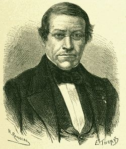

## Playfair

Aunque el método que vamos a comentar lleva el nombre de Playfair, en realidad se atribuye su invención al físico Charles Wheatstone.    Fué uno de los primeros métodos que se utilizó donde el cifrado no se hacía letra a letra sino tomando grupos de dos letras.

Para cifrar con este método necesitamos una tabla cuadrada, en general de 5 por 5, donde se escriben al azar las 25 letras del alfabeto que vamos a utilizar.  También se puede completar el cuadro utilizando una clave.  Por ejemplo, la siguiente tabla se ha construido con la palabra clave *matematicas* (eliminamos las letrasñ y w)

|     |     |     |     |    |
| --- | --- | --- | --- | ---|
| m   | a   | t   | e   | i  |
| c   | s   | b   | d   | f  |  
| g   | h   | j   | k   | l  |
| n   | o   | p   | q   | r  |
| u   | v   | x   | y   | z  |
		

El texto que vamos a cifrar lo agrupamos de dos letras en dos letras.  Cada pareja de letras se puede encuadrar en cada uno de los siguientes cuatro casos:

- Las dos letras están en la misma fila del cuadro.

- Las dos letras están en la misma columna.

- Las dos letras no están ni en la misma fila ni en la misma columna.

- Las dos letras son iguales.

El método de Playfair codifica mal los pares de letras repetidas.  Esto se puede solucionar de muchos modos.  Uno de los más comunes es añadir un nulo, por ejemplo la *x* para evitar que el caso 4 se produzca.  Veremos como se cifran entonces los otros tres casos.  

Si la pareja de letras a cifrar están en la misma fila, entonces  se sustituyen por las letras situadas inmediatamente a su derecha, teniendo en cuenta que si una es la última letra de la fila, entenderemos por siguiente, la primera letra de la fila.  En el cuadro anterior si queremos cifrar la pareja $or$ la sustituimos por la pareja PN.  Si queremos cifrar la pareja $hl$ la sustituimos por JG.

Si las letras están en la misma columna seguimos un procedimiento análogo, pero en este caso sustituimos por la letra que se encuentra debajo. Por ejemplo $bp$ se sustituye por JX.

En el caso de que las letras no estén ni en la misma linea ni en la misma columna, entonces dibujamos un rectángulo que tenga por vértices las dos letras en cuestión.  Las otras dos letras que forman los vértices del rectángulo son las que van a sustituir a nuestras letras.  Para elegir un orden escribiremos primero la que se encuentre en la misma línea que la primera letra del texto en claro. Por ejemplo, $od$ se codifica como QS, $hz$ se sustituye por LV, ...

> *Texto claro*: metododeplayfair

> *Texto cifrado*: **AIAPSQKDRJEVSIFZ**