# Criptografía Clásica

## Introducción

Una acción muy común en el día de hoy consiste en encender un móvil.  Nada más encenderlo, el teléfono nos solicita un número de cuatro dígitos, que llamamos *pin*. Inmediatamente introducimos los cuatro números y el teléfono es plenamente operativo.  Si por una desgraciada casualidad nos roban el móvil, y lo tenemos apagado, estamos seguros de que el ladrón no podrá realizar llamadas con él, puesto que necesita una contraseña, que solamente  nosotros conocemos.  Además, hemos seguido las indicaciones que nos han dado y no hemos escrito la clave en ningún lugar de los papeles que llevabamos en la cartera, que por cierto también nos  han robado.  Cual sería nuestra sorpresa si nos dijeran que nuestro número *pin* está escrito en el propio teléfono.  Más concretamente en una tarjetita que todo el mundo conoce como  SIM.  Si el ladrón es un poco espabilado, abrirá el móvil, extraerá nuestra tarjeta SIM y leerá nuestra clave.  Tenemos un problema.

Sin embargo la criptografía ha venido en nuestra ayuda.  Es cierto que la clave está escrita en nuestra tarjeta SIM, pero está codificada.  Aunque nuestro ladrón sea capaz de leerla no se enterará de nada.  Es como si estuviese escrita en un idioma que el ladrón no conoce. 

Pero ¿quien es el personaje que nos ha salvado? Según el diccionario de la Real Academia, la criptografía es el

> Arte de escribir con clave secreta o de un modo enigmático

Desde el punto de vista etimológico esta definición  es perfecta, puesto que criptografía deriva del griego  *kriptos* (oculto) y *graphein* (escribir).  Sin embargo esta definición no es del todo adecuada en el  momento actual.  Es cierto que a lo largo de la historia todos los criptógrafos tenían una parte de artistas. Pero hoy en día es más adecuado considerar a la criptografía como una ciencia y no como un arte. 

Como ciencia, la criptografía es un poco difícil de encuadrar.  Por una parte se considera que la criptografía es una parte de las matemáticas, pues son éstas las que nos permiten crear los algoritmos de codificación y de decodificación. En la criptografía clásica, los algoritmos empleados utilizaban únicamente matemática elemental. Incluso sin ningún conocimiento matemático se puede entender y utilizar este tipo de criptografía. Sin embargo, en muchos de los nuevos métodos, los conceptos y métodos matemáticos utilizados son de un alto nivel.

Pero por otra parte, en la actualidad, no se puede separar a la criptografía de su uso en el mundo de los ordenadores.  De esta forma también se puede considerar que la criptografía es una parte de la informática. Es más, al menos en España, la asignatura de *Criptografía* se imparte sobre todo carreras relacionadas con la Informática.

A nivel elemental, podemos decir que la criptografía se ocupa  de los métodos  para  escribir mensajes de algún modo que resulte difícil de leer para cualquier persona que intercepte nuestra información.  También se ocupa de los métodos  para  leer el galimatías que hemos escrito, puesto que  si no somos capaces de releer lo que hemos codificado, la criptografía sería una ciencia inútil.

Muy relacionado con la ciencia de la criptografía se halla otra ciencia: el *criptoanálisis*.  Si el enemigo intercepta nuestra información, desea poder leerla.  El criptoanálisis se ocupa de los métodos  de descifrado sin el conocimiento de la clave que se ha empleado para cifrar.  A lo largo de la historia, siempre que se ha inventado un nuevo método de codificación, los criptoanalistas del bando rival han intentado "romper" el método de cifrado.  Muchas batallas, e incluso guerras, se ganaron gracias a la labor de los criptoanalistas.

A lo largo de la historia, y hasta bien entrado el siglo *xx* la criptografía era principalmente utilizada en los ámbitos diplomático y militar.  El uso habitual de los ordenadores y la gran cantidad de información han hecho que la criptografía amplíe sus horizontes.  Prácticamente cualquier empresa de tamaño medio se ve obligada a  utilizar criptografía para proteger su información.  En caso de no usarla puede ser objeto de espionaje industrial.  Son famosos los ataques de hackers a todo tipo de ordenadores, incluyendo los de "empresas" tan grandes como el mismo Pentágono. Incluso el usuario de a pie  usaría mucha más criptografía si fuera consciente de los ataques que recibe a diario su ordenador con ánimo de extraer información.

## Herodoto

Probablemente uno de los ejemplos más antiguos del uso de la criptografía sea el referido por Herodoto en *Las historias*. En este relato, Jerjes es un rey persa y Demarato un espartano expulsado de su patria que vivía en Persia.  Jerjes planeaba formar un gran ejército para invadir Grecia. Oigamos la historia en  palabras de Herodoto.

> Volveré ahora a tomar el hilo de la historia que dejé algo atrás. Los Lacedemonios fueron los primeros que tuvieron aviso de que el rey disponía una expedición contra la Grecia, lo que les movió a enviar su consulta al oráculo de Delfos, de donde les vino la respuesta poco antes mencionada. Bien creído tengo, y me parece que no sin mucha razón, no sería muy amigo ni apasionado de los Lacedemonios Demarato, hijo de Ariston, que fugitivo de los suyos se había refugiado entre los Medos,
aunque de lo que él hizo, según voy a decir, podrán todos conjeturar si obraba por el bien que les quisiese  o por el deseo que de insultarles tenía. Lo que en efecto hizo Demarato, presente en Susa, cuando resolvió Jerjes la jornada contra la Grecia,
fue procurar que llegase la cosa a noticia de los Lacedemonios; y por cuanto corría el peligro de ser interceptado el aviso, ni tenía otro medio para comunicárselo, valióse del siguiente artificio: tomó un cuadernillo de dos hojas o tablillas; rayó bien la cera que las cubría, y en la madera misma grabó con letras
la resolución del rey. Hecho esto, volvió a cubrir con cera regular las letras grabadas, para que el portador de un cuadernillo en blanco no fuera molestado de los guardas de los caminos. Llegado ya el correo a Lacedemonia, no podían dar en el misterio los mismos de la ciudad, hasta tanto que Gorgo, hija que era de Cleomenes y esposa de Leonidas, fue la que les sugirió, según oigo decir, que rayesen la cera,
habiendo ella maliciado que hallarían escrita la carta en la misma madera. Creyéronla ellos, y hallada la carta y leída, enviáronla a los demás Griegos.

Si somos aficionados a las películas de espías, esto nos suena a las artimañas que emplean los espías para transmitir la información a sus superiores.  Muchas veces lo importante no es solo transmitir la información, sino que el enemigo crea que no ha sido posible filtrar dicha información. 

Si hábil fue el proceder de Demarato, escuchemos de nuevo a Herodoto en otro pasaje de *Las historias*.

> Entonces fue cuando Aristágoras, no pudiendo cumplir la promesa hecha a Artafernes,
viéndose agobiado con el gasto de las tropas que se le pedía, temiendo además las consecuencias de aquella su desgraciada expedición, mayormente habiéndose
enemistado en ella con Megabates, sospechando, en suma, que por ella sería depuesto del
gobierno y dominio de Mileto; amedrentado, digo, con todas estas reflexiones y motivos, empezó a maquinar una sublevación para ponerse a salvo.

> Quiso a más de esto la casualidad que en aquella agitación le viniera desde Susa, de parte de Histieo,  un enviado con la cabeza toda marcada con letras, que significaban a Aristagoras que se sublevase contra el rey. Pues como Histieo hubiese querido
prevenir a su deudo que convenía rebelarse, y no hallando medio seguro para posarle el aviso por cuanto estaban los caminos tomados de parte del rey, en tal apuro había rasurado a navaja la cabeza del criado que tenía de mayor satisfacción, habíale
marcado en ella con los puntos y letras que le pareció, esperó después que le volvieran a crecer el cabello, y crecido ya, habíalo despachado a Mileto sin más recado que decirle de palabra que puesto en Mileto pidiera de su parte a Aristagoras que, cortándole
a navaja el pelo, le mirara la cabeza. Las notas grabadas en ella significaban a Aristágoras, como dije, que se levantase contra el Persa. El motivo que para tal intento tuvo Histieo, parte nacía de la pesadumbre gravísima que su arresto en Susa le ocasionaba, parte también de la esperanza con que se lisonjeaba de que en caso de tal rebelión sería  enviado a las provincias marítimas, estando al mismo  tiempo convencido de que a menos que se rebelara Mileto, nunca más tendría la fortuna de volver a verla. Con estas miras despachó Histieo a dicho  mensajero.

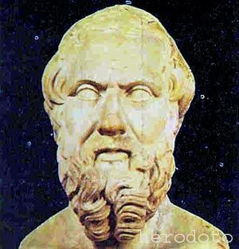

En la actualidad estas ocurrencias de los griegos no están consideradas como verdadera criptografía, puesto que el mensaje que enviaban no estaba codificado de ninguna manera.  Solamente utilizaron su imaginación para esconderlo de los posibles enemigos.  El arte o ciencia de ocultar mensajes se conoce como *esteganografia*, derivada del vocablo  griego *esteganos*, que significa cubrir. Esta palabra, como muchas otras utilizadas en criptografía, no está aun recogida en el diccionario de la Real Academia. 

El origen de este vocablo se remonta a principios del siglo *xvi*. El abad alemán Johannes Trithemius escribió un libro al que tituló *Steganographia*.  En él se trataban temas referentes a la ocultación de mensajes, pero también  métodos para conjurar a los espíritus.  El libro en cuestión está hoy considerado como un libro maldito y es muy apreciado por los esoteristas del mundo entero. Aparte de este libro, también publicó *Polygraphiae Libri Sex*, un compendio de 6 libros sobre criptografía que no participaba de los elementos esotéricos de su otro gran libro.

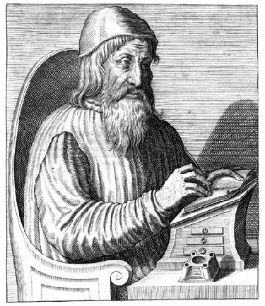

## La escítala

En la antigua Grecia, los espartanos empleaban un curioso método para trasmitir informaciones  confidenciales.  La referencia a este método se encuentra en el tomo  *iii* de las *Vidas Paralelas* de Plutarco.  La historia en cuestión no nos interesa.  Solamente debemos saber que los Éforos eran los gobernantes.

> Esto no
obstante, los Lacedemonios de todos los demás atentados
suyos se desentendieron, y sólo cuando Farnabazo, ofendido
por él, les taló y asoló el campo y envió a Esparta quien
le acusase, se indignaron los Éforos, quitando la vida a Tórax,
uno de sus amigos y colegas, porque averiguaron que en
particular poseía dinero, y enviando al mismo Lisandro la
escítala, con orden de que se presentase. Lo de la escítala es en
esta forma: cuando los Éforos mandan a alguno de comandante
de la armada o de general, cortan dos trozos de madera
redondos, y enteramente iguales en el diámetro y en el
grueso, de manera que los cortes se correspondan perfectamente
entre sí. De éstos guardan el uno, entregando el otro
al nombrado, a estos trozos los llaman escítalas. Cuando
quieren, pues, comunicar una cosa secreta e importante,
forman una  tira de papel, larga y estrecha como un
listón, y la acomodan al trozo o escítala que guardan, sin que
sobre ni falte, sino que ocupan exactamente con el papel
todo el hueco; hecho esto, escriben en el papel lo que quieren, estando arrollado en la escítala. Luego que han escrito,
quitan el papel, y sin el trozo de madera lo envían al general.
Recibido por éste, nada puede sacar de unas letras que no
tienen unión, sino que están cada una por su parte; pero
tomando su escítala, extiende en ella la cortadura de papel, de
modo que, formándose en orden el círculo, y correspondiendo
unas letras con otras, las segundas con las primeras,
se presente todo lo escrito seguido a la vista. Llámase la tira
escítala, igualmente que el trozo de madera, al modo que lo
medido suele llevar el nombre de la medida.

Para ver en la práctica como funcionaba la escítala imaginemos que tras enrollar la tira escribimos un mensaje formado por 3 filas de  9 caracteres de longitud.  Al desenrollarla obtenemos una tira con 27 letras.  La primera letra de la tira es la primera letra de la primera linea, la segunda letra de la tira es la primera letra de la segunda linea.  Así hasta la tercera letra.  La letra 4 de la tira es la segunda de la primera fila y continuamos hasta el final. En general la j-ésima letra de la i-ésima fila ocupará el lugar 

$$
3(j-1)+i
$$

Veamos ahora un ejemplo de criptograma creado utilizando  una escítala como la  comentada anteriormente.  Como es costumbre en criptografía, el texto al que no se le ha aplicado la criptografía se llama *texto claro* (otros autores lo llaman *texto plano* puesto que en inglés es *plaintext*) y se escribe en minúsculas.  El texto cifrado lo escribiremos en mayúsculas.  También es costumbre en criptografía no escribir los espacios en blanco, ni los signos de puntuación ni de acentuación.  

>*Texto llano*: ejemplodelmetododelescitalo

>|  |  |  |  |  |  |  |  |  |
| --- | --- | --- |--- | --- | --- | ---  | --- | --- | 
|e  |j  | e | m | p | l| o | d | e | 
|l  | m | e | t | o | d| o | d | e |
|l  |  e| s | c | i | t| a | l | o |

>*Texto cifrado*: **ELLJMEEESMTCPOILDTOOADDLEEO**

Para cifrar utilizando este método, si no poseemos la madera en cuestión, podemos seguir los siguientes pasos: 

- Se dibuja una cuadrícula rectangular.

- Se escribe el texto en horizontal, empezando  por la izquierda.

- El texto cifrado se obtiene leyendo en vertical lo que hemos escrito.

El mensaje cifrado depende de las dimensiones de la cuadrícula

En términos modernos decimos que este cifrado es de  *transposición*, pues a cada letra del texto cifrado le corresponde la misma letra del texto claro.  Lo único que hemos hecho es "desordenarlas" siguiendo un patrón matemático que previamente mencionamos.

El criptoanálisis de este método es muy simple.  Partimos de la primera letra y vamos tomando letras dando saltos de dos letras.  Si obtenemos un mensaje con sentido, resultará que  la escítala tenía únicamente dos líneas.  Si dando saltos de dos letras no conseguimos nada, pasamos a dar saltos de tres letras. Y continuaríamos hasta averiguar cuantas líneas tenía el mensaje.  Luego continuamos con la letra número 2 y finalmente desencriptamos el mensaje.

## Polibio

En las películas del oeste, los indios se comunicaban a larga distancia empleando *señales de humo*.  Desgraciadamente de las películas no podemos inferir el significado de las señales basándonos en su forma o duración.

Aunque este método es muy efectivo, en Grecia se empleaba otro todavía mejor. A base de antorchas, los mensajeros podían deletrear palabras y con ello enviar mensajes.  Si el mensajero sostenía tres antorchas en su mano izquierda y dos en su derecha, el receptor era capaz de interpretarlo como cierta letra.  Cambiando la disposición y cantidad de las antorchas, cambiaba también de letra.

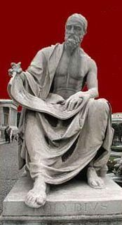

En tiempos más modernos se han empleado espejos que reflejaban la luz del sol.  Normalmente con los espejos no se utiliza el código que ahora estudiaremos, sino que se emplea el *Código Morse*. Es una especie de telégrafo óptico. 

El método de Polibio no es considerado por muchos autores como verdadera criptografía, pues su interés no reside en ocultar la información, sino en trasmitirla de un modo más eficaz.  Aun así es interesante su estudio, pues ciertas ideas se utilizan en  criptografía. 

Los métodos de sustitución se basan en asignar a  cada letra otro ente, que puede ser también otra letra, o un número o un símbolo especial.  La cifra de Polibio es históricamente la primera que emplea métodos de sustitución.  Para explicar el funcionamiento en castellano tenemos que recurrir a un truco, debido a que en nuestro idioma se emplean más de 25 letras, cosa que en latín y en griego no ocurre.  Para codificar un mensaje primeramente formamos la siguiente tabla

>|  |  |  |  |  |  |  
| --- | --- | --- |--- | --- | --- | 
|     | A   | B   | C  | D  | E   |
|A    | a   | b   | c  | d  | e   |
|B    | f   | g   | h  | i  | j   |
|C    | k   | l   | m  | n  | o   |
|D    | p   | r   | s  | t  | u   |
|E    | v   | w   | x  | y  | z   |			

La letra $a$ se cifrará como AA, la $b$ como AB,...  Hemos eliminado la letra $q$, lo cual no redunda en el contenido del mensaje, siempre que sustituyamos dicha letra por la $k$.  Tampoco hemos incorporado la ñ pues nuestra querida letra se suele llevar mal con los ordenadores.

> *Texto claro*: cifradepolibio

> *Texto cifrado*: **ACBDBADBAAADAEDACECBBDABBDCE**

Una de las ventajas del cifrador de Polibio es que emplea únicamente 5 letras para escribir cualquier mensaje, pero tiene un grave problema: el mensaje cifrado tiene el doble de longitud que el texto claro.

Para traducir matemáticamente el cifrador de Polibio, escribimos la tabla con números.  Aunque Polibio escribía las tablas con números del 1 al 5, nosotros lo haremos del 0 al 4, por ser en este caso la interpretación matemática más sencilla.

>|  |  |  |  |  |  |  
| --- | --- | --- |--- | --- | --- | 
|     | 0   | 1   | 2  | 3  | 4   |
|0    | a   | b   | c  | d  | e   |
|1    | f   | g   | h  | i  | j   |
|2    | k   | l   | m  | n  | o   |
|3    | p   | r   | s  | t  | u   |
|4    | v   | w   | x  | y  | z   |

  Para tratar matemáticamente cualquier alfabeto, lo primero que debemos hacer es asociar a cada letra un número entero.  La asociación más habitual es
  
$$
a= 0, b = 1, c= 2, \dots
$$

Observamos que el  número que le asigna la tabla de Polibio a cada letra es precisamente el número de la letra escrito en base 5. Luego el cifrador de Polibio, en su versión númerica, consiste en traducir los números  a base 5.  Debemos tener cuidado, pues si queremos, por ejemplo, escribir el número cuatro en base cinco, lo debemos escribir como $04$.

Polibio utilizo la base 5 debido a que era el cuadrado que mejor se adaptaba a su alfabeto.  En un lenguaje donde el alfabeto tuviera 98 letras distintas, deberíamos elegir una tabla de $10 \times 10$.

Un método similar al de Polibio fue propuesto por el filósofo inglés del siglo *xvi* Francis Bacon. En el método de Bacon, a cada letra del alfabeto se le asocia una secuencia de cinco letras, siendo estas letras únicamente la $A$ y la $B$. La asociación comienza así:
$$
a=AAAAA, b= AAAAB, c=AAABA, d=AAABB, \dots
$$

Si sustituimos la A por cero y la B por uno, observamos que lo único que hacemos es escribir cada letra en lenguaje binario.  Como la quinta potencia de 2 es 32, existen suficientes símbolos para codificar todas las letras, incluso en castellano. Aun así nos sobran símbolos que podemos utilizar para otros menesteres.

> *Texto claro*: bacon

> *Texto cifrado*: **AAAABAAAAAAAABAABBABABBAA**

El método de Bacon era fácilmente descifrable por cualquier persona con un poco de ingenio.  Por ello Bacon lo utilizaba junto con una técnica esteganográfica: escribía cualquier texto, pero unas letras las hacía  de una forma (modernamente diríamos que empleaba un tipo de letra) ligeramente diferente de las otras, de tal forma que solo un ojo muy entrenado notaba la diferencia.  Si la letra era de un tipo, significaba A y si era de otro tipo significaba B.

> *Texto claro*: bacon

> *Texto cifrado*: y poc**a**s son las g**r**ut**as** d**e**c**or**adas

Esta idea de Bacon, se utiliza  en los ordenadores. El código ASCII asigna un número entre 0 y 255 a muchos caracteres que utilizamos habitualmente.  Para poder manejar dichos números, el ordenador lo que hace es que lo traduce a su lenguaje, que es la base 2.  De este modo podemos entender que el código ASCII es una generalización de las ideas de Polibio y Bacon. 

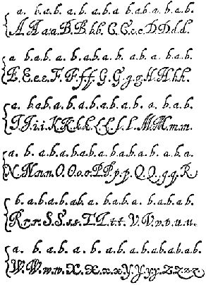

## Los hebreos

La cábala judía asocia a cada letra del alfabeto hebreo un número. Manipulando dichos números con reglas matemáticas se pretende descubrir importantes secretos, estudiando cabalísticamente el texto sagrado judío por excelencia, la *torá*.  La torá está formada por los cinco primeros libros de la biblia, (el *Pentateuco*) que según la tradición judía, fueron escritos directamente por Dios.  La creencia de que Dios codificó información importante en la biblia ha sido una constante a lo largo de la historia.  El mismo Newton creía en ello y le dedicó grandes esfuerzos, aunque no sabemos con que éxito.  Actualmente existen programas de ordenador que pretenden obtener profecías, analizando númericamente la biblia. El libro de Michael Drosnin, *El código de la Biblia*, que presenta uno de esos programas, ha sido un verdadero best-seller en todo el mundo a finales del siglo *xx*.

El pueblo judio siempre ha sido amigo de este tipo de estudios que rayan con lo esotérico.  Empleaban también en sus escritos distintos  métodos criptográficos, pero más como un medio de dar un aura de misticismo, que con el proposito de ocultar información.  De todos los métodos que empleaban el más conocido es el *atbash*, ya que aparece en la biblia, en concreto en el libro de Jeremías, donde el nombre de la ciudad de Babel se codifica como Sesac (se debe tener en cuenta que en hebreo antiguo no se escribían las vocales)

El *atbash* sustituye la primera letra del alfabeto por la última, la segunda por la penúltima y así sucesivamente.  Empleando un alfabeto latino de 26 letras (quitamos la ñ), podemos poner un

> *Texto llano*: elcodigodelabiblia

> *Texto cifrado*: **VOXLWRTLWVOZYRYORZ**

Para descifrar el mensaje debemos volver a codificarlo.  Este tipo de métodos, que emplean exactamente las misma reglas para descifrar que para cifrar, se llaman *involutivos*.

Otro método de codificación era el *Albam*.  Lo explicamos en el caso de un alfabeto de 26 letras.  La primera letra se sustituye por la letra que ocupa la posición 14, la segunda por la que ocupa la posición 15 y así sucesivamente. La letra 14 se sustituye por la primera, la letra 15 por la segunda, etc.

> *Texto llano*: elcodigodelabiblia

> *Texto cifrado*: **RYPBQVTBQRYNOVOYVN**

De nuevo estamos ante un cifrado involutivo. Ya veremos que guarda gran similitud con el método que empleaba el emperador Julio César.

Existen otros métodos de codificación, pero todos ellos se basan en la misma idea: sustituir unas letras por otras, o sustutuir letras por símbolos.  En la figura  se pueden observar 4 métodos de codificación utilizando el propio alfabeto hebreo, así como el número cabalístico asociado.

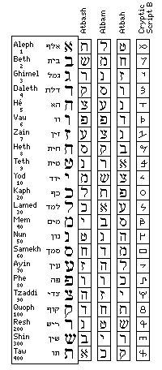

## Julio César

Julio César es considerado por muchos el mayor genio militar de la historia.  El mundo de la guerra siempre ha echado mano de la criptografía y grandes avances en este campo se deben a problemas de índole militar. El escritor romano Suetonio, en su libro *Doce Césares*, nos informa del método de cifrado de César.  Este es un extracto donde Suetonio habla de los  escritos de César.

>... Existen también sus cartas al Senado, y fue al parecer el primero en escribir sus comunicaciones en hojas dobladas en forma de oficio, pues hasta entonces las habían escrito los cónsules y generales en toda la extensión de la hoja. Se conservan, por último, sus cartas a Cicerón, así como las que escribió a sus amigos acerca de sus asuntos domésticos. Para los negocios secretos utilizaba una manera de cifra que hacía el sentido ininteligible, estando ordenadas las letras de manera que no podía formarse ninguna palabra; para descifrarlas tiene que cambiarse el orden de las letras, tomando la cuarta por la primera, esto es d por a, y así las demás. 

En el mismo libro también nos habla Suetonio de la relación de otro emperador, Augusto, con la ortografía y del método de cifra que utilizaba este emperador romano

> No observó mucho la ortografía, es decir, la forma y razón establecidas por los gramáticos para escribir, y parece que opinaba como los que desean que se escriba como se habla. Error muy extendido es omitir o invertir letras y silabas, y no hablaría de ello si no hubiese leído con sorpresa, en algunos autores, que reemplazó como ignorante y ordinario a un legado consular por haber escrito *ixi* por *ipsi*. Cuando escribía en cifra ponía la b por a, c por b y así con las otras letras; por x ponía dos a.

Despues de leer a Suetonio tenemos claro como cifraba César.  Utilizaba un método de sustitución que consistía en cambiar cada letra, por otra situada tres lugares más adelante.  A las tres últimas letras le hace corresponder las tres primeras del alfabeto. En el idioma castellano, el alfabeto cifrado es

>|  |  |  |  |  |  |  |  |  |  |  |  |  | 
| --- | --- | --- |--- | --- | --- | ---| --- | --- | --- |--- | --- | --- | 
		a|b|c|d|e|f|g|h|i|j|k|l|m
		 D|E|F|G|H|I|J|K|L|M|N|O|P
	
>|  |  |  |  |  |  |  |  |  |  |  |  |  | 
| --- | --- | --- |--- | --- | --- | ---| --- | --- | --- |--- | --- | --- | 	 
		n|o|p|q|r|s|t|u|v|w|x|y|z
		 Q|R|S|T|U|V|W|X|Y|Z|A|B|C

Utilizando la tabla anterior podemos cifrar y descifrar cualquier mensaje escrito utilizando la cifra de César.

> *Texto claro*: lacifradecesar

> *Texto cifrado*: **ODFLIRDGHFEVZAR**

En este caso nos hemos desplazado 3 letras hacia la derecha.  Podríamos tomar otro número distinto de 3 y obtener otro cifrado distinto.  

Si sabemos que un texto está cifrado con el método de César, para criptoanalizarlo debemos escribir, como mucho, 26 mensajes, desplazando en cada mensaje un número de letras.  Alguno de estos 26 mensajes es el texto en claro.  Este método de escribir todos los posibles textos en claro asociados al texto cifrado se conoce como *ataque por fuerza bruta*.  

A nivel matemático, el cifrado de César se entiende perfectamente trabajando en el grupo aditivo $\mathbb{Z*_{26*$. Si en el texto claro la letra tiene asignado un número $i$, la letra cifrada tiene asignado el número $i+3$, donde la suma se realiza modularmente (por ejemplo $25+3=2$).

Como vemos, criptoanalizar el cifrado de César es sencillo.  Los criptógrafos han tenido que inventar  métodos que generalicen el empleado directamente por César.  Uno de ellos es el *cifrado de César con clave*.  Para ello tomamos una palabra o frase arbitraria.  A la letra $a$ le asignamos la primera letra de la palabra clave.  A la $b$ le asignamos la segunda letra de la clave, a no ser que ésta coincida con la primera letra de la clave, en cuyo paso nos pasamos a la tercera y así sucesivamente.  Cuando terminemos con las letras de la clave, empezamos a colocar el resto de las letras en orden alfabético.  Lo mejor para comprenderlo es un ejemplo.  Tomemos como frase clave "elcesar". El alfabeto cifrado es entonces

>|  |  |  |  |  |  |  |  |  |  |  |  |
| --- | --- | --- |--- | --- | --- | ---| --- | --- | --- |--- | --- | 
		|l|c|c|c|c|c|c|c|c|c|c|c|
		*Alfabeto claro*:|a|b|c|d|e|f|g|h|i|j|...
		*Alfabeto cifrado*:|E|L|C|S|A|R|B|D|F|G|....
			
También podemos colocar la frase clave $k$ lugares a la derecha, sobre todo si observamos que alguna letra se codifica como ella misma.

El método de César más general es aquel en el que efectuamos una permutación arbitraria de las 26 letras del alfabeto.  Como existen $26!$ permutaciones distintas de un conjunto de 26 elementos, existen una gran cantidad de cifras distintas.  Si para cifrar utilizamos una permutación $\sigma$, para descifrar el mensaje debemos utilizar la permutación $\sigma^{-1*$.

Para criptoanalizar un texto cifrado por el método de la fuerza bruta debemos escribir $26!$ textos distintos (uno para cada permutación) y de esa manera estamos seguros que alguno de los textos es el mensaje en claro.  Este método es inviable en la práctica, puesto  $26!$ es del orden de $10^{27*$, que es un número enorme.

Durante muchos siglos la cifra de César con clave resistió ante los criptoanalistas.  Debemos esperar al apogeo de la cultura árabe en la que el matemático *Al Kindi* inventa el método del *análisis de frecuencias*, con el que es relativamente sencillo resolver el problema.

## El análisis de frecuencias

Hasta ahora todos los métodos de cifrado que hemos analizado eran de tipo *monoalfabético*.  En estos métodos tenemos dos alfabetos: uno que se emplea en el texto claro y otro que se emplea en el criptograma.  En muchas ocasiones ambos alfabetos coinciden. Lo que caracteriza a los métodos de cifrado monoalfabéticos es que el símbolo asociado a un determinada letra no cambia en toda la extensión del criptograma.  Por ejemplo, si ciframos la letra $a$ utilizando la letra $H$, en todo el criptograma, debemos sustituir $a$ por $H$.

Hasta bien entrada la Edad Media estos métodos se consideraban suficientemente seguros. Pero en el siglo *ix* un matemático árabe, que trabajaba en la *Casa de la Sabiduria* de Bagdag, escribe un libro, *Manuscrito sobre el desciframiento de mensajes criptográficos*. El nombre de este árabe es ni más ni menos que *Abu Yusuf Yaqub ibn Ishaq al-Sabbah Al-Kindi*, pero nos referiremos a él simplemente como  Al-Kindi. En su libro describe un método, *el análisis de frecuencias*, que permite "romper" todos los cifrados monoalfabéticos. Dejemos que al-Kindi nos exponga someramente su método.

> Una manera de resolver un mensaje cifrado, si sabemos en qué lengua está escrito, es encontrar un texto claro diferente escrito en la misma lengua y que sea lo suficientemente largo para llenar alrededor de una hoja, y luego contar cuántas veces aparece cada letra.  A la letra que aparece con más frecuencia la llamamos "primera", a la siguiente en frecuencia la llamamos "segunda", a la siguiente "tercera", y así sucesivamente, hasta que hayamos cubierto todas las letras que aparecen en la muestra de texto claro.

> Luego observamos el texto cifrado que queremos resolver y clasificamos sus símbolos de la misma manera.  Encontramos que el símbolo que aparece con más frecuencia y lo sustituimos con la forma de la letra "primera" de la muestra de texto claro, el siguiente símbolo más corriente lo sustituimos por la forma de la letra "segunda", y el siguiente en frecuencia lo cambiamos por la forma de la letra "tercera", y así sucesivamente, hasta que hayamos cubierto todos los símbolos del criptograma que queremos resolver.

Para poder aplicar el análisis de frecuencias, necesitamos conocer cual es el porcentaje de aparición de cada letra en los textos en claro.  Naturalmente este porcentaje depende del idioma en el que sospechamos que está escrito el mensaje.
 
 
La aplicación directa del método de Al-Kindi casi nunca descifra un criptograma, pero si suele suceder que las letras que más aparecen en el criptograma son las de mayor frecuencia del idioma.  Esto ya nos ofrece bastante información.  Del mismo modo se puede hacer una estadística de los digramas (formados por dos letras) del idioma. Esto también ayuda a descifrar.  Además de esto podemos tener en cuenta las características propias de cada letra: por ejemplo, la *q* en castellano va siempre seguida de una *u*, la letra *x* suele ir precedida de la letra *e*...  Las letras con características tan evidentes son una perdición para cualquiera que quiera utilizar una cifra monoalfabética.  Por ello, muchos criptógrafos nunca utilizan la *q*, sino que emplean la *k* y todas las *x* las sustituyen por *s*.  Aunque el mensaje en claro tenga faltas de ortografía, su sentido se recupera fácilmente.
 
 
| | | | | | |
| --- | --- | --- | --- | --- | --- |
	a| 10.60|j|0.25| r| 0.74
	b|1.16|k|0.11| s|8.47
	c|4.85|l|4.42|t|5,40
	d|5.87|m|3.11|u|4,34
	e|13.11|n|7.14|v|0.82
	f|1.13|ñ|0.10|w|0.12
	g|1.40| o|8.23|x|0.15
	h|0.60|p|2.71|y|0.79
	i|7.16|q|0.74|z|0.26
	

 
El fallo más evidente del método de al-Kindi se tiene en la novela *La disparition* de Georges Perec.  Esta obra, escrita en francés, no emplea nunca la letra *e*, que es de las más corrientes en dicho idioma.
 
Un ejemplo del método de análisis de frecuencias se puede encontrar en el libro de Edgar Allan Poe *El escarabajo de oro*. Aunque el libro puede encontrarse  en español, el criptograma que descifra su protagonista se encuentra en inglés.  
 
 
En otros idiomas las frecuencias son distintas.  Algunos emplean, con pequeñas variaciones, nuestro mismo alfabeto, pero hay muchos idiomas con un alfabeto completamente diferente, y con reglas ortográficas totalmente distintas (por ejemplo el chino se escribe en vertical y utiliza habitualmente más de 3000 caracteres).

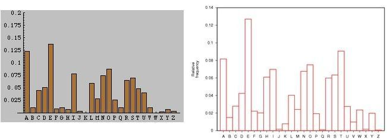
 
Una vez que se vió que el análisis de frecuencias permitía criptoanalizar textos, los diseñadores de códigos inventaron algo nuevo: los *nulos*.  Estos son caracteres que no están asociados a ninguna letra y se reparten aleatoriamente por el texto para modificar las frecuencias.  Este truco tampoco funcionó y un buen criptoanalista detecta rápidamente los nulos de los criptogramas.  

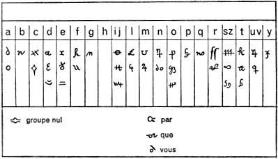

Viendo que los nulos no entorpecían mucho la labor de los rompedores de códigos, y que sin embargo alargaban de manera innecesaria los mensajes, se busco otra solución:  los *homófonos* (del griego *homo*, que significa igual y *phonos* que significa sonido).  Si la letra e aparece un trece por ciento de los casos, podemos hacer corresponder a esta letra, en vez de un solo símbolo, trece símbolos distintos.   Cada uno de estos trece símbolos se debe emplear de manera aleatoria al cifrar el texto.  Si hacemos esto con cada una de las letras, resultará que  todos los símbolos tendrán una frecuencia similar.  Además, si alguno aparece con más probabilidad no podemos estar seguros de que esté asociado a letras con un porcentaje mayor.  

El método de los homófonos también era atacable por el análisis de frecuencias.  Llego el momento en que todas  las cifras monoalfabéticas eran demasiado débiles para resistir cualquier ataque.  Se tuvo que avanzar un peldaño más en el arte de la criptografía y empezar a diseñar cifrados polialfabéticos.

## La Cifra General

En el siglo *xvi* era común que todos los gobernantes  utilizaran algún método de cifrado, sobre todo si el  mensaje debía atravesar algún territorio extranjero. La comunicación con los embajadores, y en general toda la diplomacia, utilizan de modo cotidiano la criptografía.  En tiempos de Felipe *ii* el método criptográfico más en boga era el de sustitución, aunque con una serie de aditamentos.  Trataremos aquí la conocida como *La Cifra General* que fue la primera que utilizó Felipe *ii*. Está fechada en 1556 y su original se conserva en el *Archivo de Simancas*.  

Analicemos en detalle este método de cifrado, que consta de tres partes bien diferenciadas.

- La primera es una tabla de sustitución con homófonos: cada consonante tiene dos homófonos y cada vocal tres.

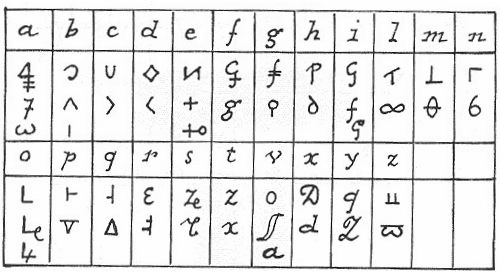

- Un método de sustitución para sílabas, también denominado  *silabario*.  Cada sílaba se puede sustituir por símbolos o por un par de números. Como se trabajaba con 130 sílabas, las últimas no tienen asociado un par de números, sino simplemente los símbolos. 

Se puede observar la gran simetría que presenta el silabario.  Cada parte de la sílaba se sustituye por un símbolo y la vocal que le acompaña es otro símbolo de menor tamaño. El símbolo de la vocal es siempre el mismo en todas las sílabas.  En la parte númerica se observa también un patrón fijo (por ejemplo, los números terminados en 3 y 8 están asociados a la letra $i$).

- Un libro de  códigos que sustituía palabras enteras.  Eran palabras comunmente usadas en aquella época en los mensajes diplomáticos. En total el libro constaba de 385 palabras.

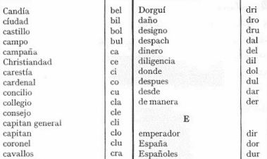

Para cifrar cualquier palabra se puede utilizar la sustitución monoalfabética, o bien el silabario, o también una mezcla de las dos.  Además, si la palabra estaba en el libro de códigos, se utiliza el código asociado.

El criptoanálisis de este método de cifrado es relativamente sencillo.  A los tres meses de ponerse en circulación, ya había sido criptoanalizada con éxito.  Y es que esta cifra presenta muchos problemas de diseño. Parece claro que el creador de esta cifra no era ningún entendido en la materia.  Cualquier persona acostumbrada a romper códigos sería consciente de las debilidades de esta cifra. Ya hemos comentado algunas debilidades del silabario.  Si todo el texto se cifra utilizan únicamente el silabario, prácticamente nos están diciendo todas las vocales del texto.  Con esto cualquier persona sin preparación puede descifrar un texto.  Pero el método de homófonos presenta problemas similares. Un buen método de homófonos tiene en cuenta la frecuencia de las letras: a mayor frecuencia, mayor número de homófonos.  Por guardar la simetría y hacer un diseño *estéticamente correcto* la Cifra General no  oculta la frecuencia de las letras y se puede hacer un ataque por un análisis de frecuencias. 

Los servicios de contraespionaje español pronto descubrieron que Francia había roto la cifra de Felipe *ii*.  El responsable de tamaña afrenta al rey español fue  *Francois Viète*, conocido en la actualidad por ser un gran matemático.  Pero entre sus virtudes también contaba con ser un esplendido criptoanalista, y descifró sin gran problema la cifra española.  Como Felipe creía que su cifra era perfectamente segura, estaba convencido que nadie era capaz de descifrarla, a no ser que fuera contando con la ayuda del *Maligno*.  Con esta fe que caracterizaba al rey español, denunció ante el Papa al rey de Francia acusándolo de utilizar magia negra y de tener pactos con el diablo, pues era el único modo posible de reventar su sistema de cifrado.  Pero el papa también tenía un gabinete de cifras y  hacía tiempo que era capaz de leer la cifra de Felipe *ii*.  Este hecho fue conocido   y el rey más poderoso de su época quedo en ridículo.  Al cabo de seis años la Cifra General fue cambiada. 

## Cardano

La paternidad del método que resuelve la ecuación de tercer grado ha sido muy controvertida en el devenir histórico.  Se conoce hoy como *fórmula de Cardano*, aunque ya Cardano reconocía que otros  autores la conocían con anterioridad.  Pero le cupo a Cardano el honor de ser el primero en publicarla, en su obra *Ars Magna*.

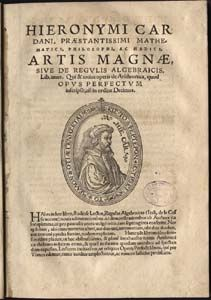

Para entender la reticencia a la publicación de sus conocimientos por los matemáticos  del Renacimiento, debemos ponernos en situación. El modo de conseguir un trabajo en una universidad o bien el mecenazgo de algún señor, era demostrar públicamente la valía del científico. Era normal que dos científicos se retasen públicamente, bien en un debate, bien resolviendo problemas o de cualquier otro modo.  En el caso de los problemas, cada matemático proponía problemas a su contrincante.  El conocimiento de algún recurso matemático desconocido por el oponente era una gran ventaja.

La versión actualmente más aceptada por los historiadores de la matemática dice que el primer mortal que descubrió la fórmula fue un profesor de la universidad de Bolonia, Scipione del Ferro. El método no resolvía la ecuación general sino las ecuaciones del tipo

$$
x^3+px+q=0
$$

que hoy se llaman *reducidas*.  Durante su vida no confesó su secreto a nadie, pero en el lecho de muerte, le transmitió su sabiduría a su discípulo Antonio Fiore. Nicolo Fontana, más conocido como Tartaglia, se vanarogliaba  de ser un gran matemático (y en efecto lo era). Hubo un reto público entre Fiore y Tartaglia.  Cada uno enviaría 30 problemas al otro.  El perdedor debía pagar una cena al vencedor y a tantos invitados como problemas hubiera resuelto el campeón.  Todos los problemas  propuestos por Fiore se basaban en la ecuación de tercer grado.   Tras un duro trabajo, la noche antes de finalizar el plazo, en un momento de inspiración, Tartaglia descubre el método que resuelve la ecuación cúbica reducida.  Esa misma noche resuelve los 30 problemas.  En cambio Fiore no resolvió prácticamente ninguno de los propuestos por Tartaglia, que eran mucho más variados.

Entretanto Cardano era ya un médico famoso.  Se entrevista con Tartaglia y le insta a que le revele el secreto de su fórmula, pues Cardano tiene intención de publicar un libro sobre álgebra y desea incluir el método de Tartaglia.  Aunque durante mucho tiempo Tartaglia se resiste, finalmente accede  a los ruegos de Cardano, pero bajo juramento de que no sea publicado ni comunicado a nadie. Este es un extracto del juramento de Cardano:

> Os juro sobre los Santos Evangelios, que si me comunicáis vuestros descubrimientos no los publicaré jamás y los anotaré sólo para mí en cifra, a fin de que nadie pueda comprenderlos hasta después de mi muerte.

Finalmente Cardano no pudo resistir la tentación de publicar el secreto, aunque según él tenía una buena excusa: tras estudiar los escritos de del Ferro, consiguio encontrar la fórmula.  Según Cardano  el método que publicó era el de del Ferro y no se sentía obligado a respetar el juramento.

No sabemos que sistema criptográfico tenía pensado utilizar Cardano para evitar que nadie fuese capaz de leerlo, pues el método criptográfico que habitualmente utilizaba era más bien débil.  Tomaba Cardano una plantilla rectangular y cuadriculada con varias casillas huecas.  Se coloca encima del papel, y utilizando las casillas huecas, se escribe el mensaje.  Después se retira la plantilla y se rellena al azar el resto.  Para descifrar el texto simplemente debemos poner nuevamente la plantilla sobre la hoja de papel.

Este método tan sencillo también sería utilizado posteriormente por el Cardenal Richelieu, pero él camuflaba sus mensajes en textos que si tenían sentido gramatical, aunque no transmitían ninguna información importante.

## Della Porta

Giovanni Battista Della Porta  es un famoso científico italiano.  En el ámbito de la criptografía su obra más importante data del 1563 y es *De Furtivis Literarum Notis*, compendio de cuatro volumenes donde además de estudiar los cifrados clásicos y su criptoanálisis, expone también un nuevo método de cifrado.  La característica principal de este método es la utilización de distintos alfabetos y de una palabra clave.  El *cifrado de Porta*  original emplea 11 alfabetos distintos. La  palabra clave  nos permite conocer en todo momento cual es el alfabeto que debemos emplear. En el caso del idioma español se deben utilizar 13 alfabetos distintos (pues utilizamos 26 letras) que se construyen  de modo análogo al que utilizó nuestro personaje para el latín.

!()[imagenes/alfabetodellaporta.jpg]
	

Para la explicación del método utilizaremos los alfabetos originales. Supongamos que la palabra clave es PORTA.  Si queremos cifrar cualquier mensaje la primera letra del mensaje está asociada a la letra clave P, la segunda a la O,\dots\  La sexta vuelve a estar asociada a la P.

Cada alfabeto tiene dos letras que le dan nombre.  Si la letra clave es P, utilizamos para cifrar el alfabeto que tiene la letra P en su nombre (en nuestro caso es el séptimo alfabeto).  Cada letra de la primera fila la sustituimos por la letra que tiene debajo en dicho alfabeto.  Si la letra que queremos codificar se encuentra en la segunda linea la sustituimos por la letra que se encuentra encima. Por una casualidad el alfabeto asociado a la O vuelve a ser el mismo, pero ya el asociado a la R es distinto (es el octavo).

> *Texto llano*: lacifradeporta

> *Clave*: PORTA

> *Texto cifrado*: **QSTNSMSVVCHMCQ**

Para recuperar el texto cifrado simplemente empleamos el mismo método que para cifrar y utilizamos naturalmente la misma clave.

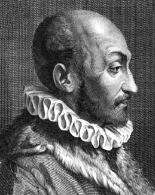
	
## Alberti

Leon Battista Alberti fue uno de los ejemplos de "homo universalis" del Renacimiento. Fue poeta, compositor, pintor, pero sobre todo es conocido como arquitecto. En el mundo de la criptografía su aportación más importante es *De Componendis Cyphris*, escrito en 1466 (aunque fue publicado un siglo más tarde). Es el libro sobre criptografía más antiguo que se conoce en el mundo occidental. Analiza en este libro los cifrados monoalfabéticos explicando el análisis de frecuencias.   Históricamente es el primero en proponer los cifrados polialfabéticos.  Aparte de esto, propone un nuevo método de cifrado de su invención que utiliza el ahora conocido como *disco de Alberti*.

> Hago dos discos con dos láminas de  cobre.  Uno, el mayor, será fijo y el otro móvil.  El diametro del disco fijo será superior en un noveno al disco móvil.  Divido la circunferencia  de los discos en 24 partes iguales llamadas sectores.  En cada uno de los sectores del disco grande escribo en orden alfabético normal una letra mayúscula roja: primero la A, seguida de la B, despues la C, etc, omitiendo H y K que no son indispensables

Como en latín no existen las letras $J,U,W,Y$,  rellena por este método solamente 20 sectores.  En los otros cuatro escribe los números $1,2,3,4$.  Prosigue con su relato de como rellenar el disco pequeño.

> ... una letra minúscula, pero no en su orden normal como en el disco fijo, sino en un orden incoherente.  De esta forma se puede suponerse que la primera letra será la $a$, la segunda la $g$, tercera la $q$ y así hasta rellenar los 24 sectores, porque el alfabeto latino consta de 24 caracteres, siendo el vigésimocuarto *et*.  Efectuadas estas operaciones, se coloca el disco pequeño sobre el grande de modo que una aguja pasada por los dos centros sirva como eje común alrededor del cual girará el disco móvil.

Ahora tomamos en el disco pequeño una letra clave, por ejemplo la $k$.  Esta letra la alínea con una cualquiera de las letras exteriores, por ejemplo con la B, e informa de esta letra al receptor del mensaje

> ... Usando este punto de partida, cada letra del mensaje representará a la letra fija que hay sobre ella.  Despues de escribir tres o cuatro letras, puedo cambiar la posición de la letra clave de modo que la $k$ esté, por ejemplo, sobre la D.  Despues en mi mensaje escribo una D mayúscula y, a partir de este punto, $k$ ya no significará $B$ y si $D$, y todas la letras del disco fijo tienen nuevas identidades.

El resultado de la explicación de Alberti puede observarse en la  figura. Utilizando esta figura procedemos a dar un ejemplo. Para seguir las indicaciones de Alberti, en este caso escribimos en mayúsculas el texto claro. 	La letra clave que alinearemos será la *k*.

	

> *Texto llano*: LEONBATTISTAALBERTI

> *Texto cifrado*: XorcfAvkfflfkNoishmdq

El método de cifrado de Alberti presenta una clara ventaja: no es posible atacarlo con el análisis de frecuencias.  Pero aun así tiene inconvenientes graves.  Para poder desencriptar el mensaje el receptor necesita un disco exactamente igual al que sirvió para crear el cifrado. No vale cualquier disco con una distribución arbitraria de las letras.  Otro problema, es que si alguien posee un disco igual al que creó el criptograma, lo descifraría con facilidad.  La seguridad de este cifrado depende de mantener secretos los discos.  En la actualidad esto se considera una falta grave de cualquier método de cifrado.

Pero el interés de la cifra de Alberti es más bien teórico.  Es el primero que utiliza un cifrado *polialfabético*.  Esto quiere decir que a lo largo del mensaje se cambia de alfabeto.  Por ejemplo, durante una parte del cifrado la letra $a$ se puede codificar como $H$, pero en otra parte se codificará con otra letra distinta.  Esta idea germinal del cifrado polialfabético será explotada por nuestro siguiente personaje.

## Vinegère y sus variantes

Blaise de Vigenère fue un diplomático francés del siglo *xvi*.  En sus trabajos como diplomático entró en contacto con el mundo de la criptografía y una vez retirado de su carrera, dedicó gran parte de su tiempo a este arte.  En 1586 publica el libro *Traité des chiffres où secrètes manières d'escrire*. En él expone su nuevo método de cifrado, que está basado en la cifra de César y utiliza las ideas de Alberti.  Imaginemos que ciframos la primera letra con un método de César de desplazamiento 3, la segunda letra con un desplazamiento 7, y en general todas las letras con un desplazamiento arbitrario.  Este método resiste el análisis de frecuencias, pues cada letra se codifica de muchas formas distintas.  Pero claro, si cambiamos arbitrariamente la cifra de César, ni nosotros mismos vamos a ser capaces de descifrarla.  Para ello Vigenère utiliza el concepto de *palabra clave*. Imaginemos que nos dan la clave VIGENERE.  Si queremos cifrar un mensaje con esta clave procedemos del siguiente modo. Para cifrar la primera letra utilizamos el alfabeto de César que comienza por V.  Para cifrar la segunda letra utilizamos el alfabeto que comienza por I, la tercera con la G...   De este modo llegamos a la octava letra.  Para la novena volvemos a utilizar el alfabeto de la V.  En  este ejemplo hemos utilizado 5 alfabetos distintos.  Eligiendo otras palabra (o frases) clave, podemos variar mucho el resultado del criptograma.

	

Para la realización práctica de este cifrado se utiliza una tabla que consta de todos los alfabetos que podemos utilizar.  También se puede utilizar un disco de Alberti especialmente adaptado.

Para complicar más el criptoanálisis del método de Vigenère se deben elegir claves mas bien largas y con pocas letras repetidas.  Cuantos más alfabetos empleemos, más difícil será realizar el criptoanálisis.

> *Texto llano*: lacifradevigenere

> *Clave*: VIGENERE

> *Texto cifrado*: **GIIMSVRHZDOKRRVVZ**

La implementación en ordenador de este método o de su estudio matemático se realiza utilizando la aritmética modular.  De la palabra clave, tomamos los números asociados. A cada letra del texto claro le debemos sumar, modularmente, las letras de la clave.

A pesar de la potencia de este método de  cifrado, realmente tardó mucho en aplicarse, fundamentalmente debido a la laboriosidad del método.  Sin embargo resistió durante muchos siglos los intentos de criptoanálisis.  Tanto es así que llegó a ser conocida como "Le chiffre indéchiffrable".

En el siglo *xix* dos personajes, de modo independiente, lograron "romper" la cifra de Vigenère. Uno de ellos es el polifacético *Charles Babbage*, que hoy es conocido fundamentalmente por sus diseños de máquinas mecánicas que presentaban todos los elementos clave de los ordenadores.  El otro fue un militar prusiano, Kasiski. Buscando repeticiones de patrones, si el cifrado es lo suficientemente largo, se puede intuir la longitud de la clave.  Si por ejemplo, la clave tiene 8 caracteres, resultará que las letras que ocupan las posiciones 1,9,17,...  se habrán cifrado con el mismo alfabeto.  A este alfabeto se le puede aplicar el análisis de frecuencias y desencriptar el mensaje.

En el pasado,  el cifrado de Vigenère utilizaba una tabla  donde aparecen listados todos los posibles alfabetos. Es lo que se conoce como *tabla de Vigenère*.  Pero resulta que dicha tabla ya la empleó Tritemius en su obra *Polygraphia*, aunque éste la denominaba *tabula recta*.  Sin embargo el método de cifrado que empleaba Tritemius era más sencillo. Para cifrar la primera letra utilizaba la primera línea (un cifrado de Cesar con desplazamiento nulo), para la segunda letra utilizaba la segunda línea (ahora un cifrado de Cesar con desplazamiento unidad)... Al llegar a la última línea volvía a empezar por la primera.
Esto equivale a utilizar el cifrado de Vigenère con una palabra clave formada por el alfabeto completo.

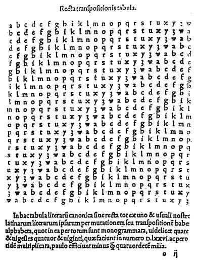

> *Texto llano*: latabularectadetritemius

> *Texto cifrado*: **LBVDFZRHZNMEMQSIHZLXGDQP**

Otra variante del cifrado de Vigenère es el *cifrado Gronsfeld*.  Este cifrado utiliza únicamente las 10 primeras líneas de la tabla, que se numeran del 0 al 9.  En este caso la palabra clave es un número, por ejemplo el 768902, que nos indica que debemos cifrar la primera letra con la fila 7, la segunda con la fila 6...

> *Texto llano*: elcrifradogronsfeld

> *Clave*: 768902

> *Texto cifrado*: **LRKAIHYGLXGTVTAOENK**

El  almirante inglés Sir Francis Beaufort inventó otro cifrado que utiliza también la tabla de Vigenère y una palabra clave. Pero el *cifrado de Beaufort* emplea un método de codificación es ligeramente distinto. Imaginemos que la clave es BEAUFORT y que el texto a cifrar es "estemetodoesunavariante". Tomamos la primera letra del texto claro, la $e$ y calculamos su número asociado. A la letra $e$ le corresponde el 4. Entonces restamos 4 a la primera letra de la clave.  Resulta que $b-4=X$. Seguimos el mismo procedimiento con el resto de las letras.

Descrito de este modo matemático, el método de Beaufort parece de una gran complicación.  Sin embargo, existe un método más intuitivo para realizar este cifrado.  Tomamos la primera letra del mensaje en la primera fila.  Bajamos por la columna de dicha letra hasta encontrar la letra de la clave que le corresponde. Después nos desplazamos por la línea de la letra clave hasta su comienzo y esa es precisamente la letra que le asigna el método de Beaufort.

> *Texto llano*: estemetodoesunavariante

> *Clave*: BEAUFORT

> *Texto cifrado*: *XMHQTKYFYQWCLBRYBNSUSVN*

Existe otro método de codificación distinto, que normalmente se llama la *variante alemana* del método de Beaufort. Para no recargar el texto no la describiremos. 

## Edgar Allan Poe

Todos los aficionados a los cuentos de terror conocen el nombre de Edgar Allan Poe.  Probablemente junto a H. P. Lovecraft es el autor de relatos de miedo más famoso de la historia.  Los adictos a su lectura son legión.  También es sobradamente conocida la obra poética de Poe, con poemas tan famosos como *Anabbel Lee*.  

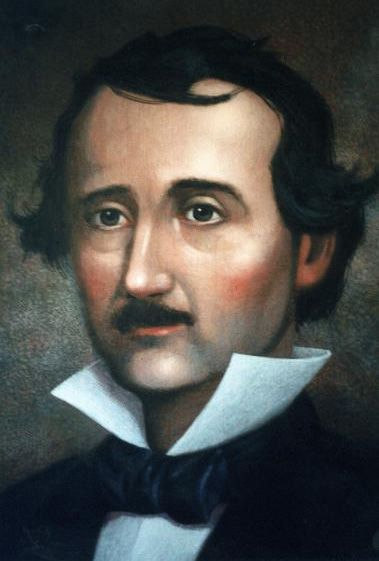
	
Sin embargo mucho menos conocida es la pasión de Poe por la criptografía. Durante mucho tiempo Poe ejerce la profesión de periodista y publica muchos artículos en revistas y periódicos. En una de ellas reta  a sus lectores a que le envien criptogramas que el resolverá. Le enviaron aproximadamente un centenar.  Casi todos cayeron bajo el infatigable criptoanálisis de Poe.  

Pero si Poe aparece en nuestra historia no es por ser un criptoanalista excepcional, sino por haber escrito *El escarabajo de oro*.  Este libro puede encuadrarse hoy  en día en la literatura juvenil y  su trama se basa en la busqueda del tesoro del pirata Kidd.  Si Kidd hubiese sido como todos los piratas, hubiera dibujado un *mapa del tesoro*. Pero el "retorcido"  Kidd dejó indicada la posición de su tesoro en un criptograma, que el protagonista, Legrand, descifra utilizando el análisis de frecuencias. Muchos jovenes, y no tan jovenes, se sienten atraidos hacia la  criptografía por la lectura de este libro. Veamos unos pasajes de este libro que nos ilustren.

> - Y el caso -dijo Legrand- que la solución no resulta tan difícil como cabe imaginarla tras del primer
examen apresurado de los caracteres. Estos caracteres, según pueden todos adivinarlo fácilmente forman
una cifra, es decir, contienen un significado pero por lo que sabemos de Kidd, no podía suponerle capaz de
construir una de las más abstrusas criptografías. Pensé, pues, lo primero, que ésta era de una clase sencilla,
aunque tal, sin embargo, que pareciese absolutamente indescifrable para la tosca inteligencia del marinero,
sin la clave.

> - ¿Y la resolvió usted, en verdad?

> - Fácilmente; había yo resuelto otras diez mil veces más complicadas. Las circunstancias y cierta
predisposición mental me han llevado a interesarme por tales acertijos, y es, en realidad, dudoso que el
genio humano pueda crear un enigma de ese género que el mismo ingenio humano no resuelva con una
aplicación adecuada. En efecto, una vez que logré descubrir una serie de caracteres visibles, no me
preocupó apenas la simple dificultad de desarrollar su significación.

> En el presente caso -y realmente en todos los casos de escritura secreta- la primera cuestión se refiere al
lenguaje de la cifra, pues los principios de solución, en particular tratándose de las cifras más sencillas,
dependen del genio peculiar de cada idioma y pueden ser modificadas por éste. En general, no hay otro
medio para conseguir la solución que ensayar (guiándose por las probabilidades) todas las lenguas que os
sean conocidas, hasta encontrar la verdadera. Pero en la cifra de este caso toda dificultad quedaba resuelta
por la firma. El retruécano sobre la palabra Kidd sólo es posible en lengua inglesa. Sin esa circunstancia
hubiese yo comenzado mis ensayos por el español y el francés, por ser las lenguas en las cuales un pirata de
mares españoles hubiera debido, con más naturalidad, escribir un secreto de ese género. Tal como se
presentaba, presumí que el criptograma era inglés.

Como dice Poe, el criptograma está en inglés y por lo tanto es un poco más difícil de analizar en español.  Pero si leemos atentamente a Poe veremos que el criptograma aparece ante nuestros ojos.

	

> *A good glass in the bishop's hostel in the devil's seat forty-one degrees and thirteen minutes northeast and by north main branch seventh limb east side shoot from the left eye of the death's-head a beeline from the tree through the shot fifty feet out 6.*

## Playfair

Aunque el método que vamos a comentar lleva el nombre de Playfair, en realidad se atribuye su invención al físico Charles Wheatstone.    Fué uno de los primeros métodos que se utilizó donde el cifrado no se hacía letra a letra sino tomando grupos de dos letras.

Para cifrar con este método necesitamos una tabla cuadrada, en general de 5 por 5, donde se escriben al azar las 25 letras del alfabeto que vamos a utilizar.  También se puede completar el cuadro utilizando una clave.  Por ejemplo, la siguiente tabla se ha construido con la palabra clave *matematicas* (eliminamos las letrasñ y w)

| | | | | | 
| --- | --- | --- | --- | ----|
m | a | t | e| i
c| s | b | d| f 
g| h|j|k|l
n|o|p|q|r
u|v|x|y|z
		

El texto que vamos a cifrar lo agrupamos de dos letras en dos letras.  Cada pareja de letras se puede encuadrar en cada uno de los siguientes cuatro casos:

- Las dos letras están en la misma fila del cuadro.

- Las dos letras están en la misma columna.

- Las dos letras no están ni en la misma fila ni en la misma columna.

- Las dos letras son iguales.

El método de Playfair codifica mal los pares de letras repetidas.  Esto se puede solucionar de muchos modos.  Uno de los más comunes es añadir un nulo, por ejemplo la *x* para evitar que el caso 4 se produzca.  Veremos como se cifran entonces los otros tres casos.  

Si la pareja de letras a cifrar están en la misma fila, entonces  se sustituyen por las letras situadas inmediatamente a su derecha, teniendo en cuenta que si una es la última letra de la fila, entenderemos por siguiente, la primera letra de la fila.  En el cuadro anterior si queremos cifrar la pareja $or$ la sustituimos por la pareja PN.  Si queremos cifrar la pareja $hl$ la sustituimos por JG.

Si las letras están en la misma columna seguimos un procedimiento análogo, pero en este caso sustituimos por la letra que se encuentra debajo. Por ejemplo $bp$ se sustituye por JX.

En el caso de que las letras no estén ni en la misma linea ni en la misma columna, entonces dibujamos un rectángulo que tenga por vértices las dos letras en cuestión.  Las otras dos letras que forman los vértices del rectángulo son las que van a sustituir a nuestras letras.  Para elegir un orden escribiremos primero la que se encuentre en la misma línea que la primera letra del texto en claro. Por ejemplo, $od$ se codifica como QS, $hz$ se sustituye por LV, ...

> *Texto claro*: metododeplayfair

> *Texto cifrado*: **AIAPSQKDRJEVSIFZ**

## Bibliografía

- Simon Singh. *Los Códigos Secretos*. Editorial Debate. Año 2000

- Edgar Allan Poe. *El Escarabajo de Oro*. Editorial Altaya. Año 1994

- Jorge Ramió Aguirre. *Libro Electrónico de Seguridad Informática y Criptografía*.  [http://www.criptored.upm.es/guiateoria/](http://www.criptored.upm.es/guiateoria/)
 
 
- Manuel J. Lucena López. *Criptografia y Seguridad en Computadores*. [http://wwwdi.ujaen.es/~mlucena/](http://wwwdi.ujaen.es/~mlucena/)

- Didier Müller. *Ars Cryptographica*. [http://www.apprendre-en-ligne.net/crypto/](http://www.apprendre-en-ligne.net/crypto/)

- Anónimo. {Aldeia Numboa*. [http://www.numaboa.com.br/](http://www.numaboa.com.br/)

- Antonio Cordoba.  *Felipe *ii*, el diablo y las matemáticas*. En prensa (Saber Leer, Enero 2003).

- Arturo Quirantes.  Boletin Enigma. [http://www.ugr.es/~aquiran/](http://www.ugr.es/~aquiran/)

- Pino Caballero Gil. *Introducción a la Criptografía*. Editorial Ra-Ma. 2002

